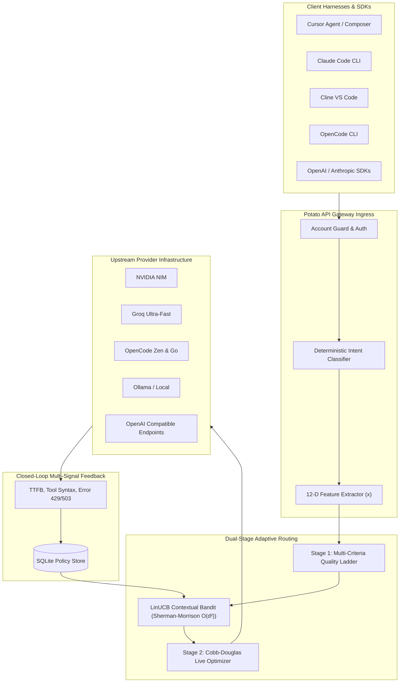

# Potato 🥔 — Enterprise LLM Gateway & Adaptive Contextual RL Auto-Router

[](https://github.com/vskrch/potato-gateway)
[](https://python.org)
[](file:///Users/venkatasai/CascadeProjects/Potato/src/potato/routing/rl_engine.py)
[](file:///Users/venkatasai/CascadeProjects/Potato/frontend)
[](LICENSE)

**Potato** is a high-performance, enterprise-grade LLM API Gateway and adaptive auto-router. Designed for modern AI engineering and agentic workflows, Potato unifies multi-provider inference pools (**NVIDIA NIM**, **Groq**, **Ollama**, **OpenCode Zen & Go**, **OpenRouter**, **Cerebras**, **Together**, **SambaNova**, **DeepSeek**, and custom endpoints) into a single, bulletproof API compatible with both **OpenAI** and **Anthropic Messages** protocols.

Potato features a production-tested **LinUCB Contextual Reinforcement Learning engine** that adapts routing weights online using real-time execution feedback (TTFB latency, function calling validity, error codes, and immediate client retries).

---

## 🏛️ System Architecture



---

## 🚀 Key Features

* **🧠 LinUCB Contextual Bandit Engine**: Dynamically weights routing choices per request using a 12-dimensional feature vector ($X$) and Sherman-Morrison rank-1 matrix inverse updates in under 1 microsecond.
* **⚡ Dual-Stage Intelligent Routing**:
  - **Stage 1 (Ladder)**: Precomputed composite score combining benchmark quality, intent affinity, parameter sizes, and provider capabilities.
  - **Stage 2 (Cobb-Douglas Optimizer)**: Real-time request adaptation balancing quality, latency, key pool availability, and provider health.
* **🎯 Granular Model Pool & Intent Gating**: Surgically restrict high-cost frontier models to specialized endpoints (e.g., `potato/coding` or `potato/best`) while excluding them from general auto-routing (`potato/auto`) to prevent token waste.
* **🔑 4-Pillar Multi-Tenant Architecture & BYOK**: Dedicated tenant isolation where standard users manage their own encrypted API keys at rest (AES-256-GCM) and view private analytics, with Admin shared fallbacks and cross-tenant oversight (`multi-tenant` branch).
* **🛡️ Zero-Downtime Fallback & Circuit Breakers**: Automatic fallbacks across providers. If a model encounters a 504 gateway timeout, rate limit (429), or 5xx server error, Potato immediately advances down the intelligence ladder without failing client requests.
* **🤖 First-Class Agent Tooling**: Native drop-in compatibility for **Cursor IDE**, **Claude Code CLI**, **Cline**, **Windsurf**, and **OpenCode CLI**.
* **📊 360° Request Explorer & Glassmorphic Dashboard**: Built with React 18 + Tailwind CSS, featuring live SSE request streams, latency waterfalls, token expenditure analytics, granular Model/Intent/Status filtering, and interactive **Adaptive RL Policy** telemetry.

---

## 🎯 Virtual Routing Models

Pass any of the following virtual model identifiers in your API requests:

| Model ID | Description | Primary Intent Target |
| :--- | :--- | :--- |
| **`potato/auto`** | Default intelligent router — dynamically picks the best model for any prompt | Dynamic auto-selection |
| **`potato/coding`** | Optimized for code generation, agentic tool execution, and multi-turn refactoring | `coding_agentic` |
| **`potato/best`** | Frontier reasoning & complex mathematical theorem proving | `reasoning` / `long_horizon` |
| **`potato/auto-fast`** | Latency-first routing prioritized for low TTFT and high TPS | `chat_fast` |
| **`potato/auto-cheap`** | Cost-optimized routing prioritizing lightweight high-efficiency models | `cheap` |

---

## 🛠️ Tool Integration Guides

### 1. Cursor IDE Setup (Agentic Custom OpenAI Base URL)

1. Open **Cursor** $\rightarrow$ **Settings** $\rightarrow$ **Models**.
2. Under **OpenAI API Key / Base URL**:
   - **OpenAI API Base URL**: `https://your-potato-domain.com/v1`
   - **API Key**: `sk-potato-YOUR-KEY`
3. Add Model: **`potato/auto`** (or `potato/coding`).
4. Select `potato/auto` as your primary active model in Cursor Agent / Composer.

---

### 2. Claude Code CLI Setup (`claude` Terminal Tool)

Potato natively serves Anthropic-compatible endpoints (`/v1/messages` and `/chat`) with full streaming support.

Add the following environment variables to your shell configuration (`~/.zshrc` or `~/.bashrc`):

```bash
export ANTHROPIC_BASE_URL="https://your-potato-domain.com/v1"
export ANTHROPIC_API_KEY="sk-potato-YOUR-KEY"
```

Then run `claude` directly in your terminal:
```bash
claude
```

---

### 3. Cline (VS Code Extension)

1. Open **Cline Settings** in VS Code.
2. Select **API Provider**: `OpenAI Compatible` (or `Anthropic Compatible`).
3. Set **Base URL**: `https://your-potato-domain.com/v1`
4. Set **API Key**: `sk-potato-YOUR-KEY`
5. Set **Model ID**: `potato/auto`

Potato automatically advertises context window sizes (`128,000` tokens) and tool capabilities to Cline via `GET /v1/models`.

---

### 4. OpenCode CLI Setup (Zen & Go Integration)

Potato natively aggregates both **OpenCode Zen** and **OpenCode Go** backends:

- **OpenCode Zen** (`https://opencode.ai/zen/v1`): Free coding agent models (`opencode/zen-free`, `mimo-v2.5-free`).
- **OpenCode Go** (`https://opencode.ai/zen/go/v1`): High-performance Go endpoints (`opencode-go/grok-4.5`, `opencode-go/glm-5.2`, `opencode-go/kimi-k3`, `opencode-go/deepseek-v4-pro`).

Configure `opencode`:

```yaml
# ~/.config/opencode/config.yaml
provider:
  name: custom
  api_base: https://your-potato-domain.com/v1
  api_key: sk-potato-YOUR-KEY
  model: opencode-go/kimi-k3  # Or potato/auto, potato/coding
```

---

## 🌐 API Protocols & Endpoints

Potato exposes three primary protocol surfaces:

| Endpoint | Protocol | Purpose |
| :--- | :--- | :--- |
| `POST /v1/chat/completions` | OpenAI Chat API | Standard OpenAI streaming & non-streaming completions |
| `POST /v1/messages` | Anthropic Messages API | Native Claude Code CLI / Anthropic SDK streaming & tool calls |
| `POST /v1/responses` | OpenAI Responses API | Native OpenAI Responses API mapping to multi-provider upstreams |
| `POST /chat` | Unified Chat API | Dual-protocol endpoint for web clients & Open WebUI |
| `GET /v1/models` | OpenAI Models API | Enriched catalog listing with context windows and capabilities |
| `GET /admin/model-pools` | Admin Control | Granular per-model intent gating & auto-router pool rules |
| `GET /v1/account/provider-keys` | BYOK Key Store | Manage tenant upstream API keys encrypted with AES-256-GCM |
| `GET /admin/rl/stats` | Admin Telemetry | Live LinUCB bandit feature weights ($\theta$) & reward statistics |
| `POST /admin/rl/reset` | Admin Action | Reset online RL policy per model or globally |
| `GET /dashboard` | Web SaaS Portal | User & Admin dashboard, telemetry, routing rules, and provider settings |

---

## 📦 Production Deployment Guide (DigitalOcean)

### ⚡ 1-Line Automatic Deployment

Run this single command on any fresh Ubuntu / DigitalOcean Droplet to install Docker, setup secrets, launch containers, configure UFW firewall rules, and verify health automatically:

```bash
curl -fsSL https://raw.githubusercontent.com/vskrch/Potato/main/deploy.sh | sudo bash
```

Or pass your domain for automatic SSL HTTPS configuration via Caddy:

```bash
DOMAIN_NAME="api.yourdomain.com" curl -fsSL https://raw.githubusercontent.com/vskrch/Potato/main/deploy.sh | sudo bash
```

---

### Option A: Manual Docker Compose Deployment

#### 1. Clone & Configure Environment
```bash
git clone https://github.com/vskrch/potato-gateway.git /opt/potato
cd /opt/potato

cat <<EOF > .env
PROXY_API_KEYS=sk-potato-YOUR-PRODUCTION-SECRET-KEY
ALLOW_INSECURE_AUTH=false
SQLITE_SEED_FREE_PRESETS=true
ANALYTICS_ENABLED=true
ROUTING_ENABLED=true
ADMIN_PASSWORD=your-secure-admin-password
NIM_API_KEYS=nvapi-your-nvidia-key
GROQ_API_KEY=gsk_your_groq_key
EOF

chmod 600 .env
```

#### 2. Start Application
```bash
docker compose -f docker-compose.do.yml up -d --build
```

#### 3. Setup Caddy SSL Reverse Proxy
```bash
# Edit /etc/caddy/Caddyfile
api.yourdomain.com {
    reverse_proxy 127.0.0.1:8080
}

sudo systemctl reload caddy
```

---

## 💻 Local Development & Testing

### 1. Build the React Dashboard
```bash
cd frontend && npm run build
```

### 2. Run the Python Backend
```bash
python3 -m uvicorn potato.main:app --port 8080 --reload
```

### 3. Run Automated Test Suite
```bash
python3 -m pytest -v
```

---

## 📄 License

MIT © Potato Team.
