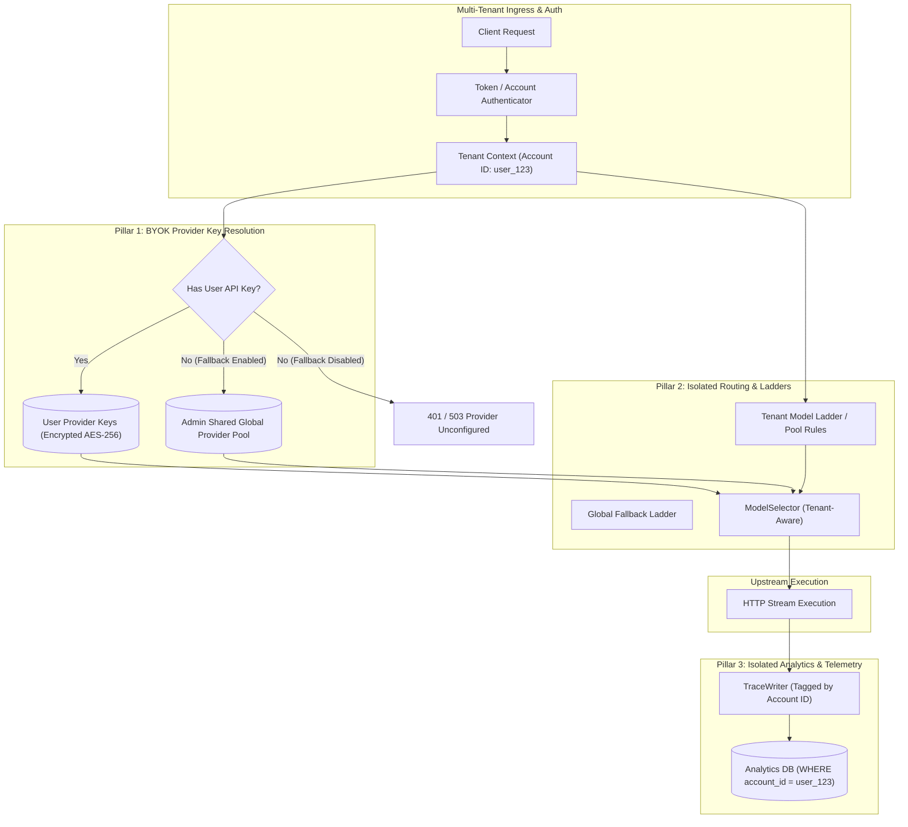

# Architectural Plan: Multi-Tenant Enterprise Gateway (BYOK & Tenant Isolation)

Transform Potato Gateway into a multi-tenant platform where standard users manage their own upstream API keys (BYOK), custom routing ladders, and private analytics, while Administrators maintain cross-tenant oversight and configure global shared fallback pools.

---

## 🏛️ Multi-Tenant Architecture Overview



---

## 🔑 Core Architectural Pillars

### Pillar 1: User-Scoped Upstream Key Store (BYOK)
- **Database Schema (`user_provider_keys`)**:
  ```sql
  CREATE TABLE IF NOT EXISTS user_provider_keys (
      account_id TEXT NOT NULL,
      provider_id TEXT NOT NULL,
      api_key_ciphertext TEXT NOT NULL,
      enabled INTEGER DEFAULT 1,
      updated_at REAL NOT NULL,
      PRIMARY KEY (account_id, provider_id)
  );
  ```
- **Key Encryption**: Encrypt user API keys at rest using **AES-256-GCM** with an application master secret key (`POTATO_MASTER_SECRET`).
- **Dynamic Provider Hub**: When a request arrives, `ProviderHub` resolves the active key pool for the requesting tenant.
- **Admin Shared Fallback Toggle**: Admins can set `ALLOW_SHARED_FALLBACK=true/false`. If enabled, users without their own key for a provider can seamlessly fall back to the Admin's shared key pool (subject to admin token quotas).

---

### Pillar 2: Tenant-Isolated Model Ladders & Gating Rules
- **Database Schema Update**: Add `account_id TEXT DEFAULT 'global'` to `model_ladders`, `preferences`, and `model_pool_config`.
- **Hierarchy Resolution**:
  1. `Tenant Ladder`: Checked first (`account_id == user_id`).
  2. `Global Admin Ladder`: Checked as fallback if no tenant override exists.

---

### Pillar 3: Tenant-Isolated Analytics & Telemetry
- **Request Tagging**: Every trace written by `TraceWriter` includes `account_id`.
- **Query Scoping**:
  - **Standard Users**: All API endpoints (`/analytics`, `/requests`, `/cost`, `/live`) filter by `WHERE account_id = :current_user_id`.
  - **Admin Users**: Have complete visibility across all tenants and aggregate metrics.

---

### Pillar 4: Admin Oversight & User Dashboard UI
- **User Dashboard Features**:
  - **My Upstream Keys (BYOK)**: Add/test OpenAI, Anthropic, Groq, NVIDIA NIM, and custom API keys.
  - **My Model Ladders**: Create custom fallback chains (`potato/coding`, `potato/best`) unique to their account.
  - **My Cost & Usage**: View private token expenditures and request latency.
- **Admin Oversight Features**:
  - Set per-tenant daily token quotas and budget caps.
  - Enable/disable global shared fallback for unfunded tenants.
  - Monitor aggregate multi-tenant performance.

---

## 📋 Phased Implementation Plan

### Phase 1: BYOK Database Schema & Encryption Core
1. Create `src/potato/accounts/byok.py` with AES-256-GCM encryption utilities.
2. Add `user_provider_keys` table to `src/potato/catalog/db.py`.
3. Update `ProviderHub` and `KeyPool` in `src/potato/catalog/hub.py` to accept per-request tenant key overlays.

### Phase 2: Router & Analytics Tenant Isolation
1. Update `ModelSelector` in `src/potato/routing/selector.py` to resolve tenant-specific ladders and pool gating rules.
2. Scope analytics queries in `src/potato/routes/analytics.py` and `requests.py` by `account_id` for non-admin users.

### Phase 3: REST API Endpoints & Admin Fallback Control
1. Add `/v1/account/keys` REST endpoints for users to manage BYOK credentials.
2. Add `/admin/tenants/settings` for Admin shared fallback and rate-limit configuration.

### Phase 4: Frontend UI Components
1. Update `AccountPage.tsx` with a sleek **My Upstream Keys (BYOK)** management tab.
2. Add tenant filter switches in Admin pages for seamless cross-tenant inspection.

---

## 🧪 Verification Plan

### Automated Unit Tests
- Create `tests/test_multi_tenancy.py`:
  - Test BYOK key isolation (User A cannot use User B's key).
  - Test Admin shared fallback behavior when User A has no key.
  - Test tenant analytics query isolation.

### End-to-End Verification
- Verify that standard users can issue requests using their own keys while keeping analytics strictly private.
