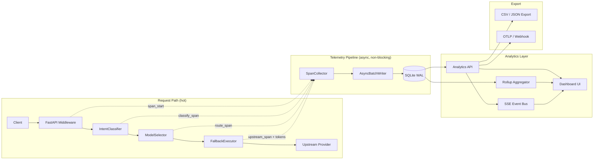

# Nimmakai Analytics Dashboard — Design Plan

> **Goal**: Commercial-grade, real-time analytics dashboard with end-to-end request tracing
> **Inspiration**: OpenRouter Activity, Langfuse Trace Waterfall, Helicone Proxy Logging, Portkey Control Plane
> **Stack**: SQLite (WAL mode) + FastAPI SSE + Vanilla JS SPA
> **Date**: 2026-07-19

---

## Table of Contents

1. [Architecture Overview](#architecture-overview)
2. [Current State Gap Analysis](#current-state-gap-analysis)
3. [Epic 1: Trace Storage Layer](#epic-1-trace-storage-layer)
4. [Epic 2: Telemetry Collection Pipeline](#epic-2-telemetry-collection-pipeline)
5. [Epic 3: Analytics API](#epic-3-analytics-api)
6. [Epic 4: Real-Time Streaming (SSE)](#epic-4-real-time-streaming-sse)
7. [Epic 5: Dashboard UI](#epic-5-dashboard-ui)
8. [Epic 6: Export & Integration](#epic-6-export--integration)
9. [Epic 7: Testing & Performance](#epic-7-testing--performance)
10. [Implementation Priority](#implementation-priority)

---

## Architecture Overview



### Design Principles (from industry research)

| Principle | Source | How We Apply |
|-----------|--------|-------------|
| **Zero-overhead telemetry** | LiteLLM async callbacks | All trace writes are async background tasks — never block the request path |
| **Structured span hierarchy** | Langfuse/OpenTelemetry | `request → classify → route → upstream[]` nested spans with timing |
| **Embedded persistence** | SQLite analytics patterns | WAL mode + batch inserts + rolling retention (no Postgres dependency) |
| **SSE for real-time** | OpenRouter Broadcast | Server-Sent Events with heartbeat (no WebSocket needed for unidirectional) |
| **Pre-aggregated rollups** | Time-series DB practices | 1-minute rollup table for fast dashboard loading; raw traces for drill-down |
| **W3C trace context** | OpenTelemetry gen_ai.* | Every request gets `trace_id` propagated through all spans |

---

## Current State Gap Analysis

### What Exists Today

| Component | File | What It Captures | Gap |
|-----------|------|-----------------|-----|
| `RequestLog` | [logging_setup.py](file:///Users/venkatasai/CascadeProjects/Nimmakai/src/nimmakai/logging_setup.py#L16-L34) | request_id, model, intent, status, duration_ms, fallback_index | **In-memory ring buffer only (200 entries), no persistence, no token counts, no per-span timing** |
| `RoutingStats` | [fallback.py](file:///Users/venkatasai/CascadeProjects/Nimmakai/src/nimmakai/routing/fallback.py#L54-L77) | intent totals, model totals, token counts per model/key | **In-memory only, lost on restart, no time-series, no per-request granularity** |
| `ModelHealthStore` | [health.py](file:///Users/venkatasai/CascadeProjects/Nimmakai/src/nimmakai/catalog/health.py) | EWMA latency, TPS, error rates, cooldowns | **In-memory only, no historical trend data** |
| `/admin/logs` | [admin.py](file:///Users/venkatasai/CascadeProjects/Nimmakai/src/nimmakai/routes/admin.py#L59-L90) | Recent request ring with basic filtering | **200-entry cap, no search, no trace detail, no aggregation** |
| `/stats` | [admin.py](file:///Users/venkatasai/CascadeProjects/Nimmakai/src/nimmakai/routes/admin.py#L166-L211) | Routing stats, key stats, catalog state | **Cumulative counters only, no time-series, no cost tracking** |

### What's Missing for Commercial Grade

1. **Persistent trace storage** — Traces survive restarts
2. **Per-request span decomposition** — Classify time, route time, upstream TTFT, total latency
3. **Token accounting** — Input/output/cached tokens per trace (extracted from upstream response)
4. **Cost estimation** — Per-model cost rates × tokens = estimated spend
5. **Time-series aggregation** — RPM, latency p50/p95/p99, error rate over time
6. **Classification confidence** — What confidence the classifier assigned and which rule fired
7. **Fallback chain visibility** — Which models were tried, in what order, which failed
8. **Real-time feed** — Live request stream in the dashboard
9. **Search & filter** — By model, provider, intent, status, time range, trace_id
10. **Export** — CSV download, OTLP broadcast for external observability

---

## Epic 1: Trace Storage Layer

### NMK-A101: SQLite Trace Schema

**File**: NEW `src/nimmakai/analytics/schema.py`

```sql
-- Core trace table: one row per API request through Nimmakai
CREATE TABLE IF NOT EXISTS traces (
    id          INTEGER PRIMARY KEY AUTOINCREMENT,
    trace_id    TEXT NOT NULL,               -- uuid hex (12 char, matches request_id)
    created_at  REAL NOT NULL,               -- unix timestamp (epoch seconds, float)
    
    -- Request metadata
    method      TEXT NOT NULL DEFAULT 'POST',
    path        TEXT NOT NULL,               -- /v1/chat/completions, /v1/embeddings
    client_ip   TEXT,
    api_key     TEXT,                        -- proxy token / user api key used
    user_agent  TEXT,
    
    -- Classification
    model_requested TEXT,                    -- what the client sent (e.g. "auto", "gpt-4o")
    intent          TEXT,                    -- coding_agentic, chat_fast, reasoning, ...
    intent_confidence REAL,                  -- 0.0 - 1.0
    intent_rule_id    TEXT,                  -- which classifier rule fired
    route_mode        TEXT,                  -- auto, alias, passthrough, ...
    
    -- Routing
    model_routed    TEXT,                    -- final model that served the request
    provider_id     TEXT,                    -- nim, groq, zen, custom-xyz
    chain_json      TEXT,                    -- JSON array: full fallback chain attempted
    fallback_index  INTEGER DEFAULT 0,      -- 0 = first try succeeded
    chain_length    INTEGER DEFAULT 1,
    
    -- Outcome
    status_code   INTEGER,
    success       INTEGER DEFAULT 1,        -- boolean: 1=success, 0=error
    error_message TEXT,
    is_stream     INTEGER DEFAULT 0,
    
    -- Timing (milliseconds)
    duration_ms     REAL,                   -- total request duration
    classify_ms     REAL,                   -- time spent in IntentClassifier
    route_ms        REAL,                   -- time spent in ModelSelector.resolve()
    upstream_ttft_ms REAL,                  -- time to first token from upstream
    upstream_total_ms REAL,                 -- total upstream response time
    
    -- Tokens
    prompt_tokens     INTEGER DEFAULT 0,
    completion_tokens INTEGER DEFAULT 0,
    cached_tokens     INTEGER DEFAULT 0,
    total_tokens      INTEGER DEFAULT 0,
    
    -- Cost (estimated, USD)
    estimated_cost_usd REAL DEFAULT 0.0,
    
    -- Context
    message_count   INTEGER DEFAULT 0,      -- number of messages in request
    has_tools       INTEGER DEFAULT 0,      -- boolean: request included tools
    has_images      INTEGER DEFAULT 0,      -- boolean: request included images
    tool_count      INTEGER DEFAULT 0,
    char_length     INTEGER DEFAULT 0       -- total input character length
);

-- Indexes for common dashboard queries
CREATE INDEX IF NOT EXISTS idx_traces_created_at ON traces(created_at);
CREATE INDEX IF NOT EXISTS idx_traces_trace_id ON traces(trace_id);
CREATE INDEX IF NOT EXISTS idx_traces_model ON traces(model_routed);
CREATE INDEX IF NOT EXISTS idx_traces_provider ON traces(provider_id);
CREATE INDEX IF NOT EXISTS idx_traces_intent ON traces(intent);
CREATE INDEX IF NOT EXISTS idx_traces_api_key ON traces(api_key);
CREATE INDEX IF NOT EXISTS idx_traces_status ON traces(status_code);
CREATE INDEX IF NOT EXISTS idx_traces_success ON traces(success, created_at);

-- Composite index for the most common dashboard query:
-- "show me requests in the last hour, sorted by time"
CREATE INDEX IF NOT EXISTS idx_traces_recent ON traces(created_at DESC, success);

-- Fallback attempts: one row per model tried in the chain
CREATE TABLE IF NOT EXISTS trace_spans (
    id          INTEGER PRIMARY KEY AUTOINCREMENT,
    trace_id    TEXT NOT NULL,
    span_type   TEXT NOT NULL,              -- 'classify', 'route', 'upstream', 'fallback_advance'
    model_id    TEXT,
    provider_id TEXT,
    started_at  REAL NOT NULL,
    ended_at    REAL,
    duration_ms REAL,
    status_code INTEGER,
    success     INTEGER DEFAULT 1,
    error_message TEXT,
    metadata_json TEXT                       -- flexible: {tokens, headers, score, reason}
);

CREATE INDEX IF NOT EXISTS idx_spans_trace ON trace_spans(trace_id);
CREATE INDEX IF NOT EXISTS idx_spans_type ON trace_spans(span_type, started_at);

-- Pre-aggregated rollups (1-minute buckets for fast dashboard loading)
CREATE TABLE IF NOT EXISTS trace_rollups (
    bucket_ts     INTEGER NOT NULL,          -- unix timestamp floored to minute
    intent        TEXT NOT NULL DEFAULT '',
    model         TEXT NOT NULL DEFAULT '',
    provider      TEXT NOT NULL DEFAULT '',
    api_key       TEXT NOT NULL DEFAULT '',  -- group by user proxy token
    
    -- Counters
    request_count   INTEGER DEFAULT 0,
    success_count   INTEGER DEFAULT 0,
    error_count     INTEGER DEFAULT 0,
    stream_count    INTEGER DEFAULT 0,
    fallback_count  INTEGER DEFAULT 0,       -- requests that needed fallback
    
    -- Token sums
    prompt_tokens_sum     INTEGER DEFAULT 0,
    completion_tokens_sum INTEGER DEFAULT 0,
    
    -- Latency aggregates
    duration_sum_ms     REAL DEFAULT 0,
    duration_max_ms     REAL DEFAULT 0,
    ttft_sum_ms         REAL DEFAULT 0,
    
    -- Cost
    cost_sum_usd        REAL DEFAULT 0.0,
    
    PRIMARY KEY (bucket_ts, intent, model, provider, api_key)
);

CREATE INDEX IF NOT EXISTS idx_rollups_bucket ON trace_rollups(bucket_ts);
CREATE INDEX IF NOT EXISTS idx_rollups_model ON trace_rollups(model, bucket_ts);
```

**Design decisions**:
- `INTEGER PRIMARY KEY AUTOINCREMENT` = efficient sequential writes
- `REAL` timestamps for sub-second precision
- `chain_json` stores the full fallback chain as JSON (denormalized for read performance)
- Separate `trace_spans` table for per-model-attempt detail (Langfuse-style drill-down)
- `trace_rollups` pre-aggregated for O(1) dashboard chart loading
- No `VACUUM` needed — use rolling retention (delete old rows by `created_at`)

**Acceptance**: Tables are created on first boot via db migration; existing `nimmakai.db` gains new tables without data loss

---

### NMK-A102: Async Batch Writer

**File**: NEW `src/nimmakai/analytics/writer.py`

**Design** (inspired by LiteLLM async logging + Helicone batch pipeline):

```python
class TraceWriter:
    """
    Non-blocking async batch writer for trace data.
    
    - Collects traces in an asyncio.Queue
    - Flushes to SQLite every 1s or every 50 traces (whichever first)
    - Uses BEGIN/COMMIT batched inserts (100x faster than individual commits)
    - Background task — never blocks the request path
    """
    
    def __init__(self, db: NimmakaiDB, *, batch_size: int = 50, flush_interval: float = 1.0):
        self._queue: asyncio.Queue[TraceRecord] = asyncio.Queue(maxsize=5000)
        self._db = db
        self._batch_size = batch_size
        self._flush_interval = flush_interval
        self._task: asyncio.Task | None = None
        self._dropped = 0  # backpressure counter
    
    async def start(self) -> None:
        self._task = asyncio.create_task(self._flush_loop())
    
    async def stop(self) -> None:
        # Flush remaining on shutdown
        ...
    
    def enqueue(self, trace: TraceRecord) -> None:
        """Fire-and-forget from request path. Never blocks. Drops if full."""
        try:
            self._queue.put_nowait(trace)
        except asyncio.QueueFull:
            self._dropped += 1
    
    async def _flush_loop(self) -> None:
        while True:
            batch = []
            try:
                # Wait for first item or timeout
                item = await asyncio.wait_for(self._queue.get(), timeout=self._flush_interval)
                batch.append(item)
            except asyncio.TimeoutError:
                pass
            # Drain up to batch_size
            while len(batch) < self._batch_size:
                try:
                    batch.append(self._queue.get_nowait())
                except asyncio.QueueEmpty:
                    break
            if batch:
                await asyncio.to_thread(self._write_batch, batch)
    
    def _write_batch(self, batch: list[TraceRecord]) -> None:
        """Synchronous SQLite batch insert in a thread."""
        conn = self._db._conn
        with self._db._lock:
            conn.execute("BEGIN")
            try:
                for trace in batch:
                    conn.execute("INSERT INTO traces (...) VALUES (...)", trace.to_row())
                    for span in trace.spans:
                        conn.execute("INSERT INTO trace_spans (...) VALUES (...)", span.to_row())
                conn.execute("COMMIT")
            except Exception:
                conn.execute("ROLLBACK")
                raise
```

**Key properties**:
- **Zero latency impact**: `enqueue()` is `put_nowait` — returns immediately
- **Backpressure**: 5000 queue cap, drops silently under extreme load (logs counter)
- **Thread offload**: SQLite writes run in `asyncio.to_thread` to avoid blocking event loop
- **Batch efficiency**: 50 traces per `BEGIN/COMMIT` = ~100x faster than individual commits

**Acceptance**: Adding trace collection does not measurably increase p99 request latency (<1ms overhead)

---

### NMK-A103: Rolling Retention & Rollup Aggregator

**File**: NEW `src/nimmakai/analytics/retention.py`

```python
class RetentionManager:
    """
    Rolling data retention + rollup aggregation.
    
    - Raw traces: keep 7 days (configurable)
    - Rollups: keep 90 days
    - Runs every 15 minutes as background task
    """
    
    async def run_cycle(self) -> dict:
        """
        1. Aggregate un-rolled raw traces into 1-minute rollup buckets
        2. Delete raw traces older than retention_days
        3. Delete rollups older than rollup_retention_days
        4. Run PRAGMA optimize
        """
```

**Config additions** to [config.py](file:///Users/venkatasai/CascadeProjects/Nimmakai/src/nimmakai/config.py):
```python
# Analytics
analytics_enabled: bool = True
analytics_retention_days: int = 7
analytics_rollup_retention_days: int = 90
analytics_batch_size: int = 50
analytics_flush_interval: float = 1.0
```

**Acceptance**: After 7 days, raw traces are deleted; rollup data remains for 90-day trend charts

---

### NMK-A104: Cost Estimation Engine

**File**: NEW `src/nimmakai/analytics/cost.py`

```python
# Per-1M-token pricing (configurable, defaults for popular free/paid models)
MODEL_COST_PER_M: dict[str, tuple[float, float]] = {
    # (input_cost_per_M, output_cost_per_M)
    "gpt-4o": (2.50, 10.00),
    "gpt-4o-mini": (0.15, 0.60),
    "claude-sonnet-4": (3.00, 15.00),
    "claude-opus-4": (15.00, 75.00),
    "deepseek-r1": (0.55, 2.19),
    "gemini-2.5-pro": (1.25, 10.00),
    # Free models = $0
    "mimo-v2.5-free": (0.0, 0.0),
    "deepseek-v4-flash-free": (0.0, 0.0),
    # ... pattern-matched for unknown models
}

def estimate_cost(model_id: str, prompt_tokens: int, completion_tokens: int) -> float:
    """Returns estimated cost in USD."""
```

> [!NOTE]
> For free-tier providers (Groq, Cerebras, OpenCode Zen), cost is $0. For custom providers, users can set custom rates via the UI. This matches OpenRouter's cost tracking model.

---

## Epic 2: Telemetry Collection Pipeline

### NMK-A201: TraceRecord Data Model

**File**: NEW `src/nimmakai/analytics/models.py`

```python
@dataclass
class TraceSpan:
    span_type: str           # 'classify', 'route', 'upstream', 'fallback_advance'
    model_id: str | None
    provider_id: str | None
    started_at: float        # time.perf_counter()
    ended_at: float | None
    duration_ms: float | None
    status_code: int | None
    success: bool
    error_message: str | None
    metadata: dict[str, Any]  # flexible per span type

@dataclass
class TraceRecord:
    trace_id: str
    created_at: float
    
    # Request
    method: str
    path: str
    client_ip: str | None
    api_key: str | None
    user_agent: str | None
    
    # Classification
    model_requested: str | None
    intent: str | None
    intent_confidence: float
    intent_rule_id: str | None
    route_mode: str | None
    
    # Routing
    model_routed: str | None
    provider_id: str | None
    chain: list[str]
    fallback_index: int
    
    # Outcome
    status_code: int | None
    success: bool
    error_message: str | None
    is_stream: bool
    
    # Timing
    duration_ms: float | None
    classify_ms: float | None
    route_ms: float | None
    upstream_ttft_ms: float | None
    upstream_total_ms: float | None
    
    # Tokens
    prompt_tokens: int
    completion_tokens: int
    cached_tokens: int
    total_tokens: int
    
    # Cost
    estimated_cost_usd: float
    
    # Context
    message_count: int
    has_tools: bool
    has_images: bool
    tool_count: int
    char_length: int
    
    # Nested spans
    spans: list[TraceSpan]
```

---

### NMK-A202: Middleware Trace Instrumentation

**File**: MODIFY [openai.py](file:///Users/venkatasai/CascadeProjects/Nimmakai/src/nimmakai/routes/openai.py#L294-L582)

**Change**: Wrap the `_chat_like()` function with span timing at each stage:

```python
async def _chat_like(request, *, upstream_path):
    trace = TraceRecord(trace_id=req_id, created_at=time.time(), ...)
    
    # Span 1: Classification
    t_classify = time.perf_counter()
    intent = classifier.classify(path=path, body=body, headers=request.headers)
    trace.classify_ms = (time.perf_counter() - t_classify) * 1000
    trace.intent = intent.intent.value
    trace.intent_confidence = intent.confidence
    trace.intent_rule_id = intent.rule_id
    trace.spans.append(TraceSpan(
        span_type='classify', started_at=t_classify, ...
    ))
    
    # Span 2: Route Selection
    t_route = time.perf_counter()
    decision = selector.resolve(...)
    trace.route_ms = (time.perf_counter() - t_route) * 1000
    trace.chain = list(decision.chain)
    trace.spans.append(TraceSpan(
        span_type='route', started_at=t_route, ...
    ))
    
    # Span 3+: Upstream Execution (via FallbackExecutor)
    # Each fallback attempt generates a span
    result = await fallback.execute_stream/json(...)
    # FallbackExecutor emits spans via callback
    
    # Extract tokens from response
    trace.prompt_tokens = usage.get('prompt_tokens', 0)
    trace.completion_tokens = usage.get('completion_tokens', 0)
    trace.estimated_cost_usd = estimate_cost(model, pt, ct)
    
    # Async enqueue — fire and forget
    writer.enqueue(trace)
```

**Critical**: The trace is assembled inline but `writer.enqueue()` is non-blocking. The only overhead is creating the `TraceRecord` dataclass (~0.1ms).

---

### NMK-A203: FallbackExecutor Span Emission

**File**: MODIFY [fallback.py](file:///Users/venkatasai/CascadeProjects/Nimmakai/src/nimmakai/routing/fallback.py#L181-L300)

**Change**: Add optional `span_callback` to FallbackExecutor that emits a `TraceSpan` for each model attempt:

```python
class FallbackExecutor:
    def __init__(self, ..., span_callback=None):
        self._span_cb = span_callback
    
    async def _try_model(self, model, ...):
        t0 = time.perf_counter()
        try:
            result = await client.request_json(...)
            elapsed = (time.perf_counter() - t0) * 1000
            if self._span_cb:
                self._span_cb(TraceSpan(
                    span_type='upstream',
                    model_id=model,
                    provider_id=pid,
                    duration_ms=elapsed,
                    status_code=result.status,
                    success=200 <= result.status < 300,
                    metadata={'tokens': {...}, 'ttft_ms': ttft}
                ))
        except Exception as exc:
            if self._span_cb:
                self._span_cb(TraceSpan(
                    span_type='fallback_advance',
                    model_id=model,
                    error_message=str(exc),
                    ...
                ))
```

**Acceptance**: Each model attempt in the fallback chain generates a span visible in the trace detail view

---

### NMK-A204: Token Extraction from Upstream Response

**File**: MODIFY [fallback.py](file:///Users/venkatasai/CascadeProjects/Nimmakai/src/nimmakai/routing/fallback.py#L440-L460)

**Current state**: Token extraction already exists at [L440-460](file:///Users/venkatasai/CascadeProjects/Nimmakai/src/nimmakai/routing/fallback.py#L440-L460) for `RoutingStats.record_tokens()`.

**Change**: Extend to also populate the `TraceRecord`:
- For JSON responses: Extract `usage.prompt_tokens`, `usage.completion_tokens`, `usage.cached_tokens`
- For streaming: Accumulate from `data: {..., "usage": {...}}` chunks (some providers send usage in the final SSE event)
- Fall back to character-based estimation: `prompt_tokens ≈ char_length / 4`

---

### NMK-A205: Request Context Extraction

**File**: MODIFY [openai.py](file:///Users/venkatasai/CascadeProjects/Nimmakai/src/nimmakai/routes/openai.py#L326-L335)

**Extend existing context** (currently only counts messages/tools):
```python
trace.message_count = len(body.get('messages') or [])
trace.has_tools = bool(body.get('tools'))
trace.tool_count = len(body.get('tools') or [])
trace.has_images = any(
    isinstance(m.get('content'), list) and
    any(c.get('type') == 'image_url' for c in m['content'] if isinstance(c, dict))
    for m in (body.get('messages') or [])
    if isinstance(m, dict)
)
trace.char_length = sum(
    len(str(m.get('content') or ''))
    for m in (body.get('messages') or [])
    if isinstance(m, dict)
)
```

---

## Epic 3: Analytics API

### NMK-A301: Trace Query Endpoints

**File**: NEW `src/nimmakai/routes/analytics.py`

```python
router = APIRouter(prefix="/analytics", tags=["analytics"])

# ─── Individual Traces ───────────────────────────────────────

@router.get("/traces")
async def list_traces(
    request: Request,
    limit: int = 50,
    offset: int = 0,
    intent: str | None = None,
    model: str | None = None,
    provider: str | None = None,
    api_key: str | None = None,
    status: str | None = None,       # "success", "error", "4xx", "5xx"
    since: float | None = None,      # unix timestamp
    until: float | None = None,
    search: str | None = None,       # search in trace_id, model, error_message
    sort: str = "created_at",        # created_at, duration_ms, total_tokens
    order: str = "desc",
) -> JSONResponse:
    """Paginated, filterable trace list for the Request Explorer."""

@router.get("/traces/{trace_id}")
async def get_trace(trace_id: str) -> JSONResponse:
    """Full trace detail with nested spans (Langfuse-style waterfall data)."""
    # Returns: trace + all trace_spans ordered by started_at

@router.get("/traces/{trace_id}/spans")
async def get_trace_spans(trace_id: str) -> JSONResponse:
    """Just the spans for a trace (for lazy-loading the waterfall)."""
```

---

### NMK-A302: Time-Series Aggregation Endpoints

```python
# ─── Time-Series (for charts) ────────────────────────────────

@router.get("/timeseries/requests")
async def request_timeseries(
    since: float | None = None,       # default: last 1 hour
    until: float | None = None,
    interval: str = "1m",             # 1m, 5m, 15m, 1h, 1d
    intent: str | None = None,
    model: str | None = None,
    provider: str | None = None,
) -> JSONResponse:
    """
    Returns time-bucketed request counts, success/error split.
    [{ts: 1721433600, requests: 42, success: 38, errors: 4, avg_ms: 1200}, ...]
    """

@router.get("/timeseries/latency")
async def latency_timeseries(...) -> JSONResponse:
    """P50, P95, P99, avg latency per time bucket."""

@router.get("/timeseries/tokens")
async def token_timeseries(...) -> JSONResponse:
    """Token consumption over time (prompt + completion + cached)."""

@router.get("/timeseries/cost")
async def cost_timeseries(...) -> JSONResponse:
    """Estimated cost over time (USD)."""

@router.get("/timeseries/ttft")
async def ttft_timeseries(...) -> JSONResponse:
    """Time-to-first-token distribution over time."""
```

---

### NMK-A303: Breakdown / Distribution Endpoints

```python
# ─── Breakdowns ──────────────────────────────────────────────

@router.get("/breakdown/models")
async def model_breakdown(
    since: float | None = None,
    until: float | None = None,
) -> JSONResponse:
    """
    Per-model aggregates: request count, tokens, cost, avg latency, error rate.
    Sorted by request count descending.
    """

@router.get("/breakdown/providers")
async def provider_breakdown(...) -> JSONResponse:
    """Per-provider aggregates."""

@router.get("/breakdown/api_keys")
async def api_key_breakdown(...) -> JSONResponse:
    """Per-user API key aggregates (usage, cost, tokens)."""

@router.get("/breakdown/intents")
async def intent_breakdown(...) -> JSONResponse:
    """Per-intent aggregates with classification confidence distribution."""

@router.get("/breakdown/errors")
async def error_breakdown(...) -> JSONResponse:
    """Error categorization: model_not_found, timeout, 429, 500, auth, etc."""

@router.get("/breakdown/fallbacks")
async def fallback_breakdown(...) -> JSONResponse:
    """Fallback chain analysis: how often each chain position is reached."""
```

---

### NMK-A304: Summary / KPI Endpoint

```python
@router.get("/summary")
async def analytics_summary(
    since: float | None = None,
    until: float | None = None,
) -> JSONResponse:
    """
    Dashboard overview KPIs (single query, cached 10s).
    {
        total_requests: 12847,
        success_rate: 0.987,
        avg_latency_ms: 1342,
        p95_latency_ms: 3200,
        avg_ttft_ms: 820,
        total_tokens: 4_500_000,
        total_prompt_tokens: 3_200_000,
        total_completion_tokens: 1_300_000,
        estimated_cost_usd: 12.47,
        unique_models: 18,
        active_providers: 5,
        top_model: "zen/mimo-v2.5-free",
        top_intent: "coding_agentic",
        fallback_rate: 0.12,
        error_rate: 0.013,
        requests_per_minute: 8.3,
        time_range: { since: ..., until: ... }
    }
    """
```

---

## Epic 4: Real-Time Streaming (SSE)

### NMK-A401: SSE Event Bus

**File**: NEW `src/nimmakai/analytics/events.py`

```python
class EventBus:
    """
    Fan-out SSE event bus for real-time dashboard updates.
    
    - Each dashboard connection subscribes via an asyncio.Queue
    - TraceWriter publishes events after each flush
    - Heartbeat every 15s to keep connections alive
    - Auto-cleanup on client disconnect
    """
    
    def __init__(self):
        self._subscribers: set[asyncio.Queue] = set()
    
    async def subscribe(self) -> AsyncIterator[str]:
        q: asyncio.Queue[str] = asyncio.Queue(maxsize=100)
        self._subscribers.add(q)
        try:
            while True:
                try:
                    event = await asyncio.wait_for(q.get(), timeout=15.0)
                    yield f"data: {event}\n\n"
                except asyncio.TimeoutError:
                    yield ": heartbeat\n\n"
        finally:
            self._subscribers.discard(q)
    
    def publish(self, event_type: str, data: dict) -> None:
        """Non-blocking publish to all subscribers."""
        payload = json.dumps({"type": event_type, **data})
        for q in list(self._subscribers):
            try:
                q.put_nowait(payload)
            except asyncio.QueueFull:
                pass  # slow consumer — drop
```

**Event types**:
| Event | Payload | When |
|-------|---------|------|
| `trace` | Compact trace summary | Every request completion |
| `stats_update` | Updated KPI snapshot | Every 5 seconds |
| `health_update` | Provider health changes | On health state change |
| `alert` | Degraded mode notification | Circuit breaker / all-chain-empty |

---

### NMK-A402: SSE Endpoint

**File**: NEW endpoint in `src/nimmakai/routes/analytics.py`

```python
@router.get("/events")
async def analytics_events(request: Request) -> StreamingResponse:
    """
    SSE stream for real-time dashboard updates.
    
    Usage: const es = new EventSource('/analytics/events?token=...');
    """
    settings = _settings(request)
    require_proxy_auth(request, settings)
    bus: EventBus = request.app.state.event_bus
    
    async def _generate():
        async for event in bus.subscribe():
            if await request.is_disconnected():
                break
            yield event
    
    return StreamingResponse(
        _generate(),
        media_type="text/event-stream",
        headers={
            "Cache-Control": "no-cache",
            "X-Accel-Buffering": "no",
            "Connection": "keep-alive",
        }
    )
```

---

## Epic 5: Dashboard UI

### Design Philosophy

> **Commercial SaaS quality** means: dark theme, glassmorphism, micro-animations, real-time data, interactive charts, and instant feedback. Think **Linear + Vercel + OpenRouter**.

The UI will extend the existing [index.html](file:///Users/venkatasai/CascadeProjects/Nimmakai/src/nimmakai/static/index.html) sidebar navigation with new "Analytics" pages.

---

### NMK-A501: Overview Dashboard Page

**Navigation**: Sidebar → "Analytics" (new top-level section)

**Layout**:
```
┌─────────────────────────────────────────────────────────────┐
│  KPI Cards (4 across)                                       │
│  ┌──────────┐ ┌──────────┐ ┌──────────┐ ┌──────────┐       │
│  │ Requests │ │ Latency  │ │  Tokens  │ │   Cost   │       │
│  │  12,847  │ │  1.34s   │ │  4.5M    │ │  $12.47  │       │
│  │ ▲ +12%   │ │ p95 3.2s │ │ in/out   │ │ ▼ -8%    │       │
│  └──────────┘ └──────────┘ └──────────┘ └──────────┘       │
│                                                             │
│  ┌─────────────────────────────────────────────────────┐    │
│  │  Request Volume Chart (area chart, stacked success/ │    │
│  │  error, 1h/6h/24h/7d time range selector)           │    │
│  └─────────────────────────────────────────────────────┘    │
│                                                             │
│  ┌──────────────────────┐  ┌───────────────────────────┐    │
│  │  Intent Distribution │  │  Top Models (bar chart)   │    │
│  │  (donut chart)       │  │  with token/cost overlay  │    │
│  └──────────────────────┘  └───────────────────────────┘    │
│                                                             │
│  ┌──────────────────────┐  ┌───────────────────────────┐    │
│  │  Provider Split      │  │  Latency Heatmap          │    │
│  │  (stacked bar)       │  │  (p50/p95/p99 over time)  │    │
│  └──────────────────────┘  └───────────────────────────┘    │
└─────────────────────────────────────────────────────────────┘
```

**KPI card behavior**:
- Animated counter on load (count-up animation)
- Sparkline mini-chart below the number (last 60 data points)
- Comparison badge: "▲ +12% vs previous period"
- Click to drill down to filtered trace list

**Charts**: Use lightweight `<canvas>` charting (no heavy library). Candidates:
- **uPlot** (14KB gzipped, 100K+ points, MIT) — recommended for time-series
- **Chart.js** if simpler interactivity needed
- Custom SVG for donut/pie charts

---

### NMK-A502: Request Explorer Page

**Navigation**: Sidebar → "Requests"

**Layout**:
```
┌─────────────────────────────────────────────────────────────┐
│  Filter Bar                                                            │
│  ┌─────────┐ ┌─────────┐ ┌─────────┐ ┌─────────┐ ┌─────────┐ ┌──────┐ │
│  │ Intent ▾│ │ Model ▾ │ │Provider▾│ │API Key ▾│ │Status ▾ │ │Search│ │
│  └─────────┘ └─────────┘ └─────────┘ └─────────┘ └─────────┘ └──────┘ │
│  Time Range: [1h] [6h] [24h] [7d] [Custom]                            │
│                                                              │
│  ┌───────────────────────────────────────────────────────┐   │
│  │  Trace Table (virtualized, paginated)                 │   │
│  │  ┌──────┬─────────┬────────┬──────┬──────┬─────────┐ │   │
│  │  │ Time │ Model   │ Intent │ Tok  │ Lat  │ Status  │ │   │
│  │  ├──────┼─────────┼────────┼──────┼──────┼─────────┤ │   │
│  │  │19:04 │mimo-2.5 │coding  │ 1.2k │ 1.3s │ ● 200   │ │   │
│  │  │19:03 │deepseek │coding  │ 800  │ 2.1s │ ● 200   │ │   │
│  │  │19:03 │mimo-2.5 │chat    │ 340  │ 0.4s │ ● 200   │ │   │
│  │  │19:02 │n/a      │coding  │  -   │  -   │ ● 503   │ │   │
│  │  └──────┴─────────┴────────┴──────┴──────┴─────────┘ │   │
│  └───────────────────────────────────────────────────────┘   │
│                                                              │
│  Expanded Trace Detail (click a row):                        │
│  ┌───────────────────────────────────────────────────────┐   │
│  │  Trace Waterfall (Langfuse-style)                     │   │
│  │                                                       │   │
│  │  ▸ classify  [0ms ─ 2ms]  intent=coding 0.92         │   │
│  │  ▸ route     [2ms ─ 4ms]  chain=[mimo, deepseek, ...]│   │
│  │  ✗ upstream  [4ms ─ 1204ms] mimo-v2.5-free → 404     │   │
│  │  ✓ upstream  [1205ms ─ 3400ms] deepseek-v4 → 200     │   │
│  │    ├─ TTFT: 820ms                                     │   │
│  │    ├─ Tokens: 400 in / 800 out                        │   │
│  │    └─ Cost: $0.00 (free)                              │   │
│  │                                                       │   │
│  │  [Request JSON]  [Response Preview]  [Copy Trace ID]  │   │
│  └───────────────────────────────────────────────────────┘   │
└─────────────────────────────────────────────────────────────┘
```

**Trace waterfall design** (inspired by Langfuse):
- Horizontal bar chart showing each span's duration relative to total
- Color-coded: green=success, red=error, yellow=timeout, gray=skipped
- Click to expand span → shows metadata JSON, error details, tokens
- Timeline ruler at top showing millisecond marks

---

### NMK-A503: Model Analytics Page

**Navigation**: Sidebar → "Models" (enhanced from current)

```
┌─────────────────────────────────────────────────────────────┐
│  Model Leaderboard Table                                     │
│  ┌──────────────┬───────┬───────┬──────┬───────┬──────────┐ │
│  │ Model        │ Reqs  │ Tok/s │ Lat  │ Err%  │ Cost     │ │
│  ├──────────────┼───────┼───────┼──────┼───────┼──────────┤ │
│  │ mimo-v2.5    │ 4,200 │ 85.3  │ 1.1s │ 1.2%  │ $0.00    │ │
│  │ deepseek-v4  │ 3,100 │ 62.1  │ 1.8s │ 2.1%  │ $0.00    │ │
│  │ qwen3.5-72b  │  800  │ 45.2  │ 2.4s │ 0.8%  │ $1.20    │ │
│  └──────────────┴───────┴───────┴──────┴───────┴──────────┘ │
│                                                              │
│  Model Comparison Charts (click models to compare):          │
│  ┌──────────────────────┐  ┌──────────────────────┐          │
│  │ Latency Distribution │  │ Token Usage Over Time│          │
│  │ (histogram overlay)  │  │ (stacked area)       │          │
│  └──────────────────────┘  └──────────────────────┘          │
│                                                              │
│  ┌──────────────────────┐  ┌──────────────────────┐          │
│  │ Error Rate by Model  │  │ TTFT Distribution    │          │
│  │ (heatmap)            │  │ (box plot / violin)  │          │
│  └──────────────────────┘  └──────────────────────┘          │
└─────────────────────────────────────────────────────────────┘
```

---

### NMK-A504: Provider Health Page

**Navigation**: Sidebar → "Providers" (enhanced from current)

```
┌─────────────────────────────────────────────────────────────┐
│  Provider Cards (responsive grid)                            │
│                                                              │
│  ┌──────────────────────────┐  ┌──────────────────────────┐ │
│  │  OpenCode Zen            │  │  NVIDIA NIM              │ │
│  │  ● Online  ██████░░ 85%  │  │  ● Online  ████████ 99%  │ │
│  │                          │  │                          │ │
│  │  Requests: 4,200         │  │  Requests: 2,800         │ │
│  │  Avg TPS:  85.3 tok/s    │  │  Avg TPS:  42.1 tok/s    │ │
│  │  Latency:  1.1s          │  │  Latency:  1.8s          │ │
│  │  Errors:   12 (1.2%)     │  │  Errors:   3 (0.1%)      │ │
│  │  Keys:     2/2 active    │  │  Keys:     1/1 active    │ │
│  │                          │  │                          │ │
│  │  [Sparkline: req/min]    │  │  [Sparkline: req/min]    │ │
│  │  [Circuit: CLOSED ●]     │  │  [Circuit: CLOSED ●]     │ │
│  └──────────────────────────┘  └──────────────────────────┘ │
│                                                              │
│  Provider Health Timeline (stacked area chart):              │
│  ┌──────────────────────────────────────────────────────┐    │
│  │  Shows request distribution across providers over    │    │
│  │  time — visualizes failover events and traffic shifts│    │
│  └──────────────────────────────────────────────────────┘    │
└─────────────────────────────────────────────────────────────┘
```

---

### NMK-A505: Live Feed Page

**Navigation**: Sidebar → "Live Feed"

```
┌─────────────────────────────────────────────────────────────┐
│  [● LIVE]  Connected via SSE                    [Pause] [⚙]│
│                                                              │
│  ┌──────────────────────────────────────────────────────┐    │
│  │  Auto-scrolling request stream (last 100)            │    │
│  │                                                      │    │
│  │  19:04:32  ● coding_agentic → mimo-v2.5-free        │    │
│  │            1.3s | 1.2k tokens | chain[0] | $0.00    │    │
│  │                                                      │    │
│  │  19:04:31  ● chat_fast → nemotron-super-49b          │    │
│  │            0.4s | 340 tokens  | chain[0] | $0.00    │    │
│  │                                                      │    │
│  │  19:04:30  ● coding_agentic → deepseek-v4-flash      │    │
│  │            2.1s | 800 tokens  | chain[1] ⚠️ fallback│    │
│  │                                                      │    │
│  │  19:04:29  ✗ coding_agentic → FAILED                 │    │
│  │            503 | all models exhausted | chain[12]    │    │
│  └──────────────────────────────────────────────────────┘    │
│                                                              │
│  Live KPI Tickers:                                           │
│  ┌──────────┐ ┌──────────┐ ┌──────────┐ ┌──────────┐       │
│  │ RPM: 8.3 │ │ Err: 1%  │ │ TTFT:0.8s│ │ Active:18│       │
│  └──────────┘ └──────────┘ └──────────┘ └──────────┘       │
└─────────────────────────────────────────────────────────────┘
```

**SSE integration**:
- `EventSource` connects to `/analytics/events`
- New traces animate in from top with fade-in
- Error traces pulse red
- Fallback traces show warning badge
- Pause button stops auto-scroll but keeps buffering

---

### NMK-A506: Intent Distribution Page

```
┌─────────────────────────────────────────────────────────────┐
│  Intent Flow Visualization                                   │
│                                                              │
│  Request → [Classifier] → Intent    → [Selector] → Model   │
│                                                              │
│  ┌────────────────────────────────────────────────────┐      │
│  │  Sankey Diagram: Request → Intent → Model          │      │
│  │                                                    │      │
│  │  100% ━━━┳━ coding_agentic (68%) ━━┳━ mimo (45%) │      │
│  │          ┃                          ┣━ deepseek   │      │
│  │          ┣━ chat_fast (22%) ━━━━━━━━┻━ nemotron   │      │
│  │          ┗━ reasoning (10%) ━━━━━━━━━━ deepseek   │      │
│  └────────────────────────────────────────────────────┘      │
│                                                              │
│  Classification Confidence Distribution:                     │
│  ┌────────────────────────────────────────────────────┐      │
│  │  Histogram of confidence scores per intent         │      │
│  │  (are we classifying confidently or guessing?)     │      │
│  └────────────────────────────────────────────────────┘      │
│                                                              │
│  Rule Firing Frequency:                                      │
│  ┌────────────────────────────────────────────────────┐      │
│  │  Table: rule_id | fires | avg_confidence           │      │
│  │  agent_fingerprint: 4,200 | 0.92                   │      │
│  │  has_tools: 2,100 | 0.85                            │      │
│  │  code_fences: 800 | 0.78                            │      │
│  │  default_coding: 1,200 | 0.55  ⚠️ low confidence   │      │
│  └────────────────────────────────────────────────────┘      │
└─────────────────────────────────────────────────────────────┘
```

---

### NMK-A507: Cost Center Page

```
┌─────────────────────────────────────────────────────────────┐
│  Cost Overview                                               │
│                                                              │
│  ┌──────────┐ ┌──────────┐ ┌──────────┐ ┌──────────┐       │
│  │Today     │ │This Week │ │This Month│ │Projected │       │
│  │ $2.47    │ │ $12.80   │ │ $48.20   │ │ $52.00   │       │
│  └──────────┘ └──────────┘ └──────────┘ └──────────┘       │
│                                                              │
│  Cost by Model (treemap visualization):                      │
│  ┌────────────────────────────────────────────────────┐      │
│  │  ┌───────────────────┐ ┌──────────┐ ┌───────────┐ │      │
│  │  │                   │ │ qwen3.5  │ │ gemini    │ │      │
│  │  │   claude-opus-4   │ │  $4.20   │ │  $1.80   │ │      │
│  │  │     $24.00        │ ├──────────┤ ├───────────┤ │      │
│  │  │                   │ │deepseek  │ │  free ×8  │ │      │
│  │  │                   │ │  $2.10   │ │  $0.00   │ │      │
│  │  └───────────────────┘ └──────────┘ └───────────┘ │      │
│  └────────────────────────────────────────────────────┘      │
│                                                              │
│  Cost by API Key (horizontal bar chart):                     │
│  ┌────────────────────────────────────────────────────┐      │
│  │  █ user-token-123 ($32.40)                         │      │
│  │  █ user-token-456 ($12.20)                         │      │
│  │  █ custom-key-789 ($3.60)                          │      │
│  └────────────────────────────────────────────────────┘      │
│                                                              │
│  Token Burn Rate:                                            │
│  ┌────────────────────────────────────────────────────┐      │
│  │  Area chart: input tokens vs output tokens/hour    │      │
│  │  with cost overlay line                            │      │
│  └────────────────────────────────────────────────────┘      │
│                                                              │
│  Custom Cost Rates:                                          │
│  ┌────────────────────────────────────────────────────┐      │
│  │  Editable table for per-model pricing overrides    │      │
│  │  Model | Input $/M | Output $/M | [Save]           │      │
│  └────────────────────────────────────────────────────┘      │
└─────────────────────────────────────────────────────────────┘
```

---

### NMK-A508: Analytics Settings

```python
# Settings panel within the Analytics section:
# - Retention period (7d default)
# - Rollup retention (90d)
# - Cost rate overrides
# - Export configuration
# - SSE connection status
```

---

## Epic 6: Export & Integration

### NMK-A601: CSV / JSON Export

```python
@router.get("/export/traces")
async def export_traces(
    format: str = "csv",   # csv | jsonl
    since: float | None = None,
    until: float | None = None,
    limit: int = 10000,
) -> StreamingResponse:
    """Stream export for large datasets."""
```

**CSV columns**: `trace_id, created_at, model_requested, model_routed, intent, intent_confidence, provider, status_code, duration_ms, ttft_ms, prompt_tokens, completion_tokens, cost_usd, fallback_index, error_message`

---

### NMK-A602: OpenTelemetry OTLP Export Hook

**File**: NEW `src/nimmakai/analytics/otel.py`

```python
class OTLPExporter:
    """
    Optional: export traces to any OTLP-compatible collector.
    
    Uses gen_ai.* semantic conventions:
    - gen_ai.system = "nimmakai"
    - gen_ai.request.model = model_requested
    - gen_ai.response.model = model_routed
    - gen_ai.usage.input_tokens = prompt_tokens
    - gen_ai.usage.output_tokens = completion_tokens
    """
```

> [!NOTE]
> OTLP export is optional and requires `opentelemetry-api` + `opentelemetry-sdk`. It's a separate pip extra: `pip install nimmakai[otel]`. This follows LiteLLM's pattern of optional observability integrations.

---

### NMK-A603: Webhook Broadcast

```python
# Similar to OpenRouter's Broadcast feature
# Config: ANALYTICS_WEBHOOK_URL=https://your-system.com/webhook
# Each trace is POSTed as JSON to the webhook URL
# Batched: up to 50 traces per POST
# Retry: 3 attempts with exponential backoff
```

---

## Epic 7: Testing & Performance

### NMK-A701: Trace Writer Load Test

**File**: NEW `tests/test_analytics_perf.py`

**Test**: Enqueue 1000 traces in 1 second → verify all flushed to SQLite within 5 seconds, no drops

**Acceptance**: <1ms per `enqueue()` call, batch write of 50 traces <10ms

---

### NMK-A702: End-to-End Trace Verification

**File**: NEW `tests/test_analytics_e2e.py`

**Tests**:
1. Send `/v1/chat/completions` request → verify trace appears in `/analytics/traces`
2. Verify all spans present (classify, route, upstream)
3. Verify token counts match upstream response
4. Verify fallback chain visibility when first model fails

---

### NMK-A703: Retention Cleanup Test

**File**: NEW `tests/test_analytics_retention.py`

**Test**: Insert traces with old timestamps → run retention cycle → verify old traces deleted, rollups preserved

---

### NMK-A704: SSE Integration Test

**File**: NEW `tests/test_analytics_sse.py`

**Test**: Connect to `/analytics/events` → send a request → verify SSE event received with correct trace_id

---

### NMK-A705: Dashboard UI Smoke Test

**File**: NEW `tests/test_analytics_ui.py` (Playwright)

**Tests**:
1. Navigate to analytics overview → verify KPI cards render
2. Open request explorer → verify table populates
3. Click a trace row → verify waterfall expands
4. Open live feed → verify SSE connection indicator

---

## Implementation Priority

### Phase 1: Foundation (Estimated: 3-4 days)
| # | Ticket | Description | Priority |
|---|--------|-------------|----------|
| 1 | NMK-A101 | SQLite trace schema + migration | P0 |
| 2 | NMK-A201 | TraceRecord data model | P0 |
| 3 | NMK-A102 | Async batch writer | P0 |
| 4 | NMK-A202 | Middleware trace instrumentation | P0 |
| 5 | NMK-A204 | Token extraction from upstream | P0 |

### Phase 2: API Layer (Estimated: 2-3 days)
| # | Ticket | Description | Priority |
|---|--------|-------------|----------|
| 6 | NMK-A301 | Trace query endpoints | P0 |
| 7 | NMK-A304 | Summary KPI endpoint | P0 |
| 8 | NMK-A302 | Time-series aggregation | P0 |
| 9 | NMK-A303 | Breakdown endpoints | P1 |
| 10 | NMK-A104 | Cost estimation engine | P1 |

### Phase 3: Real-Time (Estimated: 1-2 days)
| # | Ticket | Description | Priority |
|---|--------|-------------|----------|
| 11 | NMK-A401 | SSE event bus | P0 |
| 12 | NMK-A402 | SSE endpoint | P0 |
| 13 | NMK-A203 | FallbackExecutor span emission | P1 |

### Phase 4: Dashboard UI (Estimated: 5-7 days)
| # | Ticket | Description | Priority |
|---|--------|-------------|----------|
| 14 | NMK-A501 | Overview dashboard page | P0 |
| 15 | NMK-A502 | Request explorer + waterfall | P0 |
| 16 | NMK-A505 | Live feed page | P0 |
| 17 | NMK-A503 | Model analytics page | P1 |
| 18 | NMK-A504 | Provider health page | P1 |
| 19 | NMK-A506 | Intent distribution page | P1 |
| 20 | NMK-A507 | Cost center page | P2 |
| 21 | NMK-A508 | Analytics settings | P2 |

### Phase 5: Polish & Export (Estimated: 2-3 days)
| # | Ticket | Description | Priority |
|---|--------|-------------|----------|
| 22 | NMK-A103 | Rolling retention + rollup aggregator | P1 |
| 23 | NMK-A205 | Request context extraction | P1 |
| 24 | NMK-A601 | CSV/JSON export | P1 |
| 25 | NMK-A602 | OTLP export hook | P2 |
| 26 | NMK-A603 | Webhook broadcast | P2 |

### Phase 6: Testing (Estimated: 2 days)
| # | Ticket | Description | Priority |
|---|--------|-------------|----------|
| 27 | NMK-A701 | Trace writer load test | P1 |
| 28 | NMK-A702 | E2E trace verification | P0 |
| 29 | NMK-A703 | Retention cleanup test | P1 |
| 30 | NMK-A704 | SSE integration test | P1 |
| 31 | NMK-A705 | Dashboard UI smoke test | P2 |

---

## File Structure (New Files)

```
src/nimmakai/
  analytics/
    __init__.py
    schema.py          # NMK-A101: SQLite DDL + migration
    models.py          # NMK-A201: TraceRecord, TraceSpan dataclasses
    writer.py          # NMK-A102: AsyncBatchWriter
    retention.py       # NMK-A103: Rolling retention + rollup aggregation
    cost.py            # NMK-A104: Cost estimation engine
    events.py          # NMK-A401: SSE EventBus
    otel.py            # NMK-A602: Optional OTLP export
    webhook.py         # NMK-A603: Webhook broadcast
  routes/
    analytics.py       # NMK-A301-A304, A402: REST + SSE endpoints
  static/
    js/
      analytics/
        overview.js    # NMK-A501
        explorer.js    # NMK-A502
        models.js      # NMK-A503
        providers.js   # NMK-A504
        live.js        # NMK-A505
        intents.js     # NMK-A506
        cost.js        # NMK-A507
        charts.js      # Shared charting utilities (uPlot wrapper)
        api.js         # Analytics API client
        sse.js         # EventSource manager
tests/
  test_analytics_perf.py   # NMK-A701
  test_analytics_e2e.py    # NMK-A702
  test_analytics_retention.py  # NMK-A703
  test_analytics_sse.py    # NMK-A704
  test_analytics_ui.py     # NMK-A705
```

---

## Competitive Feature Matrix

| Feature | OpenRouter | Langfuse | Helicone | Portkey | **Nimmakai (Planned)** |
|---------|-----------|---------|---------|---------|---------------------|
| Request logging | ✅ | ✅ | ✅ | ✅ | ✅ |
| Token tracking | ✅ | ✅ | ✅ | ✅ | ✅ |
| Cost estimation | ✅ | ✅ | ✅ | ✅ | ✅ |
| Trace waterfall | ❌ | ✅ | ❌ | ⚠️ | ✅ |
| Intent classification visibility | ❌ | ❌ | ❌ | ❌ | ✅ ★ unique |
| Fallback chain visualization | ❌ | ❌ | ❌ | ⚠️ | ✅ ★ unique |
| Real-time SSE feed | ❌ | ❌ | ❌ | ❌ | ✅ |
| Provider health dashboard | ❌ | ❌ | ❌ | ✅ | ✅ |
| Classification confidence | ❌ | ❌ | ❌ | ❌ | ✅ ★ unique |
| Self-hosted / no external deps | ❌ | ✅ | ❌ | ❌ | ✅ |
| SQLite (zero-ops) | ❌ | ❌ (Postgres) | ❌ | ❌ | ✅ |
| OTLP export | ✅ (Broadcast) | ✅ | ❌ | ✅ | ✅ |
| CSV export | ❌ | ✅ | ✅ | ✅ | ✅ |

> [!IMPORTANT]
> **Nimmakai's unique value**: No other gateway shows **intent classification confidence**, **fallback chain visualization**, and **per-span routing decisions** in a single self-hosted UI. This is the differentiator for commercial positioning.

---

## Performance Budget

| Metric | Target | How |
|--------|--------|-----|
| Trace enqueue latency | <1ms | Fire-and-forget `put_nowait` |
| Batch write (50 traces) | <10ms | `BEGIN/COMMIT` + WAL mode |
| Dashboard page load | <200ms | Pre-aggregated rollups + index-optimized queries |
| SSE event latency | <100ms | Direct publish from writer |
| SQLite file size (7 days) | <500MB @ 10 RPM | ~7KB/trace × 100K traces |
| Memory overhead | <50MB | Queue + rollup cache only |

> [!TIP]
> At 10 RPM sustained (typical for a coding proxy), you'll generate ~100K traces/week. At ~7KB per trace (with spans), that's ~700MB per week. The 7-day retention keeps the SQLite file under 1GB. For higher throughput, decrease retention or increase rollup interval.
