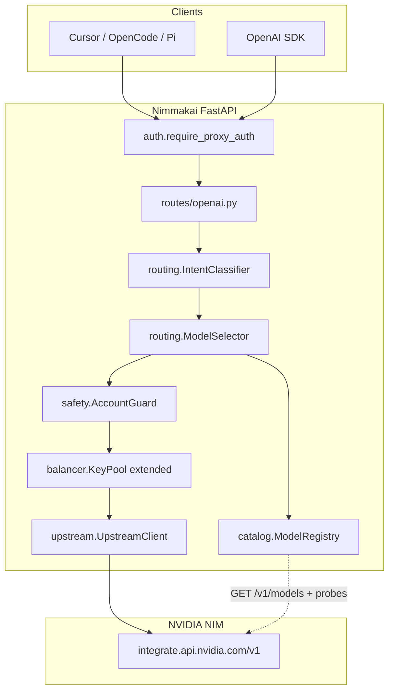
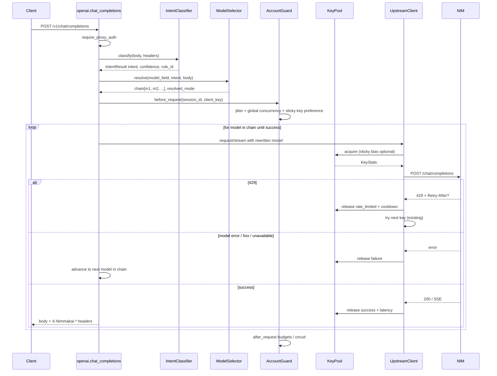
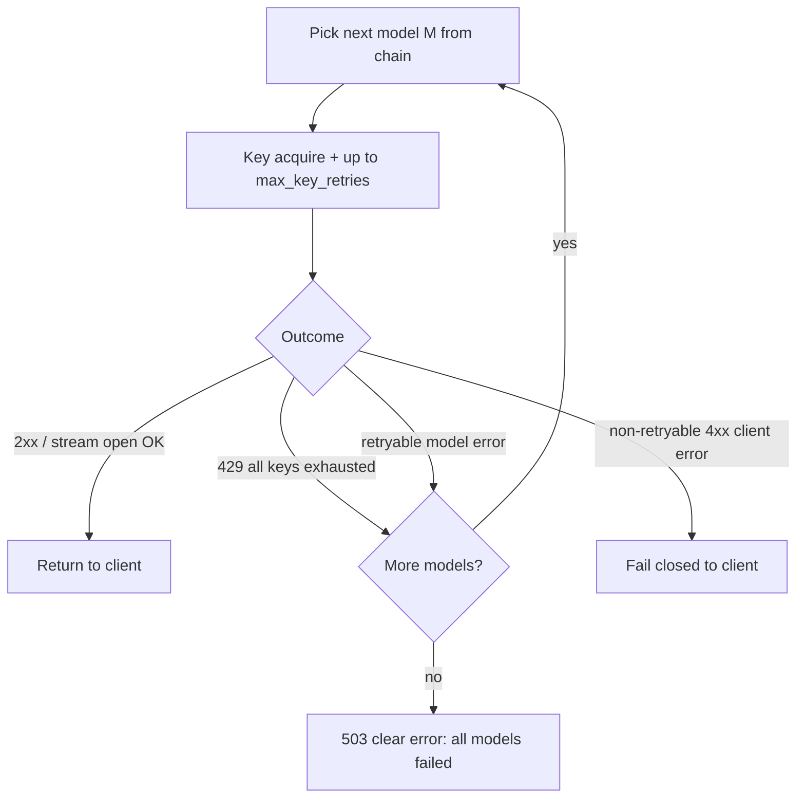

# Nimmakai Intelligent Model Router + Account-Safe Multi-Key Proxy

| Field | Value |
|-------|-------|
| **Author** | TBD |
| **Date** | 2026-07-10 |
| **Status** | Implemented (v0.2.0) |
| **Workspace** | `/Users/venkatasai/CascadeProjects/Nimmakai` |
| **Related** | Bootstrap proxy (`KeyPool`, `UpstreamClient`, OpenAI routes) |

---

## Overview

Nimmakai is an OpenAI-compatible FastAPI proxy that fronts NVIDIA NIM (`https://integrate.api.nvidia.com/v1`) and fans traffic across multiple `nvapi-` keys with per-key RPM windows, EWMA latency scoring, and 429 cooldowns. The bootstrap already delivers multi-key balancing and transparent `/v1/*` passthrough for coding agents (Cursor, OpenCode, Pi, etc.).

This design extends that foundation with three tightly coupled capabilities:

1. **Intelligent model routing** — deterministic (and optionally LLM-assisted) intent classification that maps requests to quality-ordered model chains (coding/agentic, chat, reasoning, vision, light).
2. **Ordered fallback** — intentional quality/health-aware model chains instead of random or single-model hard-fail.
3. **Account-safe multi-key operation** — sustainable personal multi-account usage via soft budgets, jitter, sticky sessions, circuit breakers, concurrency caps, and fail-closed behavior — without ToS-evasion strategies (IP rotation farms, CAPTCHA solving, identity automation).

The design **extends** `KeyPool` (`src/nimmakai/balancer.py`) and the request path in `routes/openai.py` + `upstream.py`; it does not rewrite the bootstrap. Catalog data lives in versioned YAML, refreshed against `GET /v1/models` and health probes.

---

## Background & Motivation

### Current state (bootstrap)

| Component | Path | Role |
|-----------|------|------|
| App lifespan | `src/nimmakai/main.py` | Creates `KeyPool` + `UpstreamClient`, mounts routers |
| Settings | `src/nimmakai/config.py` | `NIM_API_KEYS`, RPM limit × 0.9 safety, cooldown, `DEFAULT_MODEL` |
| Key pool | `src/nimmakai/balancer.py` | Sliding-window RPM, weighted pick (headroom × 1/latency × success × concurrency), 429 cooldown |
| Forwarder | `src/nimmakai/upstream.py` | `request_json` / `stream` with up to 3 key rotations on 429 |
| Auth | `src/nimmakai/auth.py` | Client Bearer / `x-api-key` vs `PROXY_API_KEYS` |
| OpenAI surface | `src/nimmakai/routes/openai.py` | chat/completions, completions, embeddings, responses, models |
| Admin | `src/nimmakai/routes/admin.py` | `/health`, `/stats` |

**What works well:** multi-key RPM headroom, latency-aware weighting, stream byte-for-byte proxy (preserves tool_calls SSE), simple client gate.

**Pain points for agent workloads:**

1. **No model intelligence** — clients must send real NIM ids (`org/model`). Cursor defaults (`gpt-4o`, `claude-*`, auto) either fail or require manual mapping. `DEFAULT_MODEL` is a blunt instrument.
2. **No quality-aware fallback** — upstream failures (model unavailable, 5xx, context overflow) return immediately after key retries; there is no ordered *model* chain.
3. **Account safety is partial** — RPM window + 429 cooldown exist, but there is no daily budget, auth quarantine (401/403), sticky session, request jitter, global concurrency cap, or Retry-After respect.
4. **No catalog awareness** — model ids on build.nvidia.com change and deprecate; hardcoding is fragile.
5. **Agent quality** — coding agents need strongest tool-capable models for multi-file / tool / system-prompt-heavy traffic, and cheap/fast models for trivial Q&A, without burning frontier RPM.

### Free-tier reality (mid-2026, non-SLA)

- Hosted OpenAI-compatible API: `https://integrate.api.nvidia.com/v1`
- Catalog: ~80–100+ models at `https://build.nvidia.com/models` (growing; ids change)
- Community free tier: roughly **~40 RPM per account**, model- and traffic-dependent — **not a published SLA**
- No official free-tier RPM increase via forums; production path is AI Enterprise / self-host NIM
- Auth: `nvapi-` keys from build.nvidia.com (phone verification common)

### Why now

Coding agents generate bursty, tool-heavy, multi-turn traffic. Users naturally want:

- “auto” model that picks the best free NIM model for the job;
- multiple personal keys without tripping account risk through robotic patterns;
- predictable quality when a primary model is down or rate-limited at the *model* layer.

---

## Goals & Non-Goals

### Goals

1. **Intent-aware automatic model selection** for `model=auto`, aliases (`gpt-4o`, `claude-*`, Cursor defaults), and missing model — with explicit real NIM ids passed through.
2. **Ordered fallback chains** per intent, reordered lightly by live model+key health (error rate, EWMA latency), never random quality demotion.
3. **Account-safe multi-key sustainability**: soft RPM (existing), global soft limits, jitter, daily budgets, 401/403 quarantine, sticky sessions, max in-flight per key/global, Retry-After, human-like concurrency, fail-closed clear errors.
4. **Versioned model catalog** (`config/models.yaml`) + startup/periodic `GET /v1/models` probe + health probes; aliases and tiers externalized.
5. **Agent quality**: preserve streaming tool_calls; surface `X-Nimmakai-Model`, `X-Nimmakai-Intent`, `X-Nimmakai-Key-Id`; rule-first classifier &lt;5ms.
6. **Incremental delivery** via ordered PRs that each leave the proxy shippable.

### Non-Goals

1. **Not** a ToS-circumvention system: no residential proxy farms, CAPTCHA solving, fake phone identity automation as product features.
2. **Not** a full multi-tenant SaaS control plane / billing system.
3. **Not** replacing NVIDIA’s catalog with a permanent hard-coded model list as the sole source of truth.
4. **Not** fine-tuning or hosting models; Nimmakai remains a proxy/router.
5. **Not** guaranteed free-tier capacity aggregation — multi-account free-tier use may violate NVIDIA ToS; document user responsibility and legitimate alternatives (enterprise, self-host).
6. **Not** multi-region geo routing or complex Redis-backed distributed pool in v1 (may be a later PR; single-process in-memory is the design baseline).

---

## Proposed Design

### High-level architecture



### Request lifecycle (chat/completions)



### Module layout (new + extended)

```
src/nimmakai/
  main.py                 # wire registry, safety, refresh tasks
  config.py               # new settings for routing/safety/catalog paths
  balancer.py             # extend KeyStats / KeyPool (sticky, budgets, quarantine)
  upstream.py             # Retry-After, model-fallback hooks, UA, diagnostics
  auth.py                 # unchanged core; optional session id extraction
  routes/
    openai.py             # route through classifier + selector + headers
    admin.py              # /stats extended; /catalog, /routing debug
  routing/
    __init__.py
    intents.py            # Intent enum + IntentResult
    classifier.py         # rule engine (+ optional LLM classify)
    selector.py           # alias → chain → health reorder
    fallback.py           # execute ordered chain; classify retryable errors
  catalog/
    __init__.py
    schema.py             # pydantic models for YAML
    registry.py           # load YAML, merge /v1/models, health
    aliases.py            # gpt-4o / claude / auto maps
    health.py             # per-(model, key_id) EWMA + error rate
  safety/
    __init__.py
    jitter.py
    budgets.py            # daily RPD / token soft budgets per key
    circuit.py            # quarantine on 401/403, open/half-open
    sticky.py             # session → key_id affinity
    concurrency.py        # global + per-key max in-flight
  config/
    models.yaml           # versioned tiers, chains, aliases (repo)
```

> Note: application package remains under `src/nimmakai/`; YAML lives at repo root `config/models.yaml` (or `src/nimmakai/data/models.yaml` packaged as package data). Prefer **repo-root `config/models.yaml`** with settings path override for user edits without reinstalling.

### 1. Model catalog (`catalog/`)

#### Versioned config (`config/models.yaml`)

Catalog is **configuration**, not code. Schema sketch:

```yaml
version: 1
updated: "2026-07-10"
defaults:
  auto_mode_model_tokens: ["auto", "nimmakai/auto", ""]
  passthrough_if_known: true
  max_fallback_attempts: 3
  classify_mode: rules_only   # rules_only | rules_then_llm

aliases:
  # Client / Cursor conveniences → either a NIM id or an intent chain name
  gpt-4o: chain:coding_agentic
  gpt-4o-mini: chain:chat_fast
  gpt-4.1: chain:coding_agentic
  gpt-4: chain:coding_agentic
  claude-3.5-sonnet: chain:coding_agentic
  claude-sonnet-4: chain:coding_agentic
  claude-opus-4: chain:coding_agentic
  o1: chain:reasoning
  o3: chain:reasoning
  o3-mini: chain:reasoning
  o4-mini: chain:reasoning
  cursor-small: chain:chat_fast
  default: chain:coding_agentic

intents:
  coding_agentic:
    description: "Tools, multi-file, agent harnesses, repo coding"
    chain:
      - minimaxai/minimax-m2.7
      - minimaxai/minimax-m2.5
      - moonshotai/kimi-k2.5
      - deepseek-ai/deepseek-v3.1   # example; refresh from live catalog
      - openai/gpt-oss-120b
      - nvidia/nemotron-3-super
  chat_fast:
    description: "Plain Q&A, summaries, short chat"
    chain:
      - google/gemma-4-31b-it
      - openai/gpt-oss-20b
      - deepseek-ai/deepseek-v3-flash  # example Flash variant
  reasoning:
    description: "Math, logic, deep multi-step reasoning"
    chain:
      - openai/gpt-oss-120b
      - moonshotai/kimi-k2-thinking
      - zai/glm-5.1
      - openai/gpt-oss-20b
  long_horizon:
    description: "Long agentic planning / large context engineering"
    chain:
      - moonshotai/kimi-k2.6
      - moonshotai/kimi-k2.5
      - zai/glm-5.1
      - nvidia/nemotron-3-super
  vision:
    description: "Image + text VLM"
    chain:
      - qwen/qwen2.5-vl-72b-instruct   # example; validate against live /v1/models
      - moonshotai/kimi-k2.5
  embeddings:
    description: "Embedding models only"
    chain: []   # filled from live catalog filter capability=embedding

models:
  # Optional per-model metadata overlays (capabilities, quality rank, soft RPM)
  minimaxai/minimax-m2.7:
    tiers: [coding, agentic, tools]
    quality_rank: 100
    supports_tools: true
    supports_vision: false
  google/gemma-4-31b-it:
    tiers: [chat, fast]
    quality_rank: 40
    supports_tools: true
```

**Critical:** model ids in the table above are **curated starting points** from the mid-2026 free NIM landscape. Runtime **must** intersect chains with live `GET /v1/models` availability. Unavailable ids are skipped with a warning log, not hard-fail at startup (unless `strict_catalog: true`).

#### `ModelRegistry` responsibilities

| Method | Behavior |
|--------|----------|
| `load_yaml(path)` | Parse + validate with pydantic |
| `refresh_from_upstream(upstream)` | `GET /v1/models`; mark known/unknown; update last_seen |
| `is_known(model_id) -> bool` | Present in live catalog (or YAML allowlist if probe failed) |
| `resolve_alias(name) -> AliasTarget` | NIM id or chain name |
| `chain_for_intent(intent) -> list[str]` | Ordered, filtered by availability + capability flags |
| `record_outcome(model, key_id, success, latency, status)` | Feed `catalog.health` |
| `health_reorder(chain) -> list[str]` | Stable sort: preserve quality order primarily; among equally ranked or on repeated failures, promote healthier |

#### Health model (`catalog/health.py`)

Track stats keyed by `(model_id, key_id)` and aggregate by `model_id`:

- `ewma_latency` (alpha=0.3, same spirit as `KeyStats`)
- `success_count` / `error_count` / `unavailable_count`
- `cooldown_until` for model-level 404/“model not found” soft blackout (e.g. 5–15 min)

**Reorder rule (quality-first):**

```
final_chain = filter_available(yaml_chain)
# Only bubble a later model ahead of an earlier one if:
#   earlier has error_rate > threshold over N samples OR is in model cooldown
# Never randomly shuffle quality ranks.
```

#### Refresh cadence

- Startup: best-effort `GET /v1/models` (use first available key from pool).
- Periodic: every `CATALOG_REFRESH_SECONDS` (default 300).
- On repeated “model not found” for a chain head: opportunistic refresh + blackout that model.

### 2. Intent classification (`routing/classifier.py`)

**Latency budget:** rule path **&lt;5ms** p99 on a laptop-class CPU. No network I/O on the rule path.

#### Intent enum

```python
class Intent(str, Enum):
    CODING_AGENTIC = "coding_agentic"
    CHAT_FAST = "chat_fast"
    REASONING = "reasoning"
    LONG_HORIZON = "long_horizon"
    VISION = "vision"
    EMBEDDINGS = "embeddings"
    UNKNOWN = "unknown"  # maps to default coding_agentic for chat APIs
```

#### Rule engine (deterministic, ordered, first match wins with scoring)

Features extracted from the OpenAI-style body (no full tokenization required):

| Signal | Source | Weight toward |
|--------|--------|---------------|
| `tools` / `functions` non-empty | body | `coding_agentic` |
| `tool_choice` not null/none | body | `coding_agentic` |
| `messages` contain `tool` / `function` role | body | `coding_agentic` |
| System prompt markers (Cursor, Cline, Aider, “You are a powerful agentic…”, repo path dumps) | messages | `coding_agentic` |
| Code fences ` ``` ` count ≥ 1 **and** multi-message / long user | messages | `coding_agentic` |
| Approximate char length of concatenated messages &gt; `LONG_CONTEXT_CHARS` (e.g. 48k) | messages | `long_horizon` (or coding if tools also present) |
| Image parts (`image_url`, `input_image`, multimodal content arrays) | messages | `vision` |
| Keywords: prove, theorem, derivative, integral, complexity proof, step-by-step reason | last user text | `reasoning` |
| Short single-turn, no tools, &lt; `SHORT_CHAT_CHARS` (e.g. 800), no code fences | body | `chat_fast` |
| Path is `/v1/embeddings` | route | `embeddings` |
| Path is `/v1/completions` legacy | route | default `chat_fast` unless code-like |

**Cursor / agent system prompt fingerprints** (substring match, case-insensitive samples):

- `You are a powerful agentic AI coding assistant`
- `Cursor` / `open_and_recently_viewed_files` / `codebase_search`
- `You are Auto` / `apply_patch` / `read_file` tool schemas
- OpenCode / Cline / Continue typical tool names

Implementation sketch:

```python
@dataclass(frozen=True)
class IntentResult:
    intent: Intent
    confidence: float          # 0..1
    rule_id: str               # e.g. "tools_present"
    features: dict[str, Any]   # for debug headers /stats

class IntentClassifier:
    def classify(self, *, path: str, body: dict, headers: dict) -> IntentResult:
        # pure CPU, no await
        ...
```

#### Optional LLM classify

- Only if `classify_mode=rules_then_llm` **and** confidence &lt; `LLM_CLASSIFY_THRESHOLD` (e.g. 0.55) **and** model field is auto/alias.
- Uses a **fast** chain model (`chat_fast` head) with a tiny JSON-only prompt.
- **Cache** `(hash of features + truncated last user 512 chars) → Intent` for `LLM_CLASSIFY_CACHE_TTL` (e.g. 600s), size-capped LRU.
- Count against RPM/budgets like any other call; prefer skipping under high pool pressure (`pool available RPM &lt; threshold` → stick with best rule guess).

**Default production mode:** `rules_only`.

### 3. Model selection (`routing/selector.py`)

Resolution algorithm:

```
function resolve(body.model, intent, registry):
  raw = body.model or settings.default_model or "auto"

  if raw in auto_tokens:
    return registry.chain_for_intent(intent), mode="auto"

  if registry.is_alias(raw):
    target = registry.resolve_alias(raw)
    if target is chain:
      return registry.chain_for_intent(target.intent_or_chain), mode="alias"
    if target is model_id:
      return health_reorder([target] + optional_sibling_fallbacks), mode="alias_model"

  if registry.is_known(raw) or looks_like_nim_id(raw):  # contains "/"
    # Explicit client choice: passthrough primary
    # Optional: still attach same-intent fallbacks if ENABLE_FALLBACK_ON_EXPLICIT=true
    if passthrough_only:
      return [raw], mode="passthrough"
    else:
      return [raw] + rest_of_intent_chain_excluding(raw), mode="passthrough_with_fallback"

  # Unknown non-NIM string (e.g. "gpt-4o-2024-xx" not in aliases)
  return registry.chain_for_intent(intent), mode="unknown_alias_as_auto"
```

**Passthrough principle:** If the client sends a real NIM id that exists (or looks like `org/model`), **respect it**. Auto/alias path is for convenience and Cursor defaults.

### 4. Ordered fallback execution (`routing/fallback.py`)

Separate **key rotation** (existing, same model) from **model fallback** (new, next chain entry).



**Retryable (advance model):**

- 404 / model not found / “unknown model”
- 503 / 502 / 500 from upstream (after key retries)
- Timeout / connect errors after key retries
- 429 when **all keys** are cooling down for this attempt window (optional advance — model-specific RPM can differ; default: stay on model until keys recover **or** `FALLBACK_ON_POOL_EXHAUST=true`)

**Non-retryable (return to client):**

- 400 validation (bad schema) — except when body was only wrong due to model capability (e.g. tools unsupported): then advance model
- 401 from **proxy** auth (never hits upstream loop)
- Explicit content filter policy if present and deterministic

**Streaming constraint:** Once bytes have been yielded to the client for model M1, **do not** silently switch to M2 mid-stream. Model fallback only happens:

1. Before stream headers/body are committed, or
2. On pre-stream failure (429/5xx before first chunk).

If stream starts then fails mid-way, surface error to client (agents typically retry the whole request).

**Response headers (always when routing engaged):**

| Header | Example |
|--------|---------|
| `X-Nimmakai-Model` | `minimaxai/minimax-m2.7` |
| `X-Nimmakai-Intent` | `coding_agentic` |
| `X-Nimmakai-Key-Id` | `key-2` |
| `X-Nimmakai-Route-Mode` | `auto` \| `alias` \| `passthrough` |
| `X-Nimmakai-Fallback-Index` | `0` (or `1` if second model used) |
| `X-Nimmakai-Rule-Id` | `tools_present` |

Also rewrite response JSON `model` field to the **actual** upstream model used (agents and logs benefit). Document that this differs from some proxies that echo the request model.

### 5. Account safety (`safety/` + KeyPool extensions)

Honest framing: multi-account free-tier aggregation may violate NVIDIA ToS. Nimmakai designs for **resilient legitimate personal usage** patterns, documents risk, and recommends enterprise / self-host for production scale.

#### 5.1 Extend `KeyStats` / `KeyPool` (keep existing scoring)

Add fields to `KeyStats` (`balancer.py`):

```python
@dataclass
class KeyStats:
    # ... existing fields ...
    auth_failures: int = 0
    quarantined_until: float = 0.0   # 401/403 circuit
    daily_count: int = 0
    daily_window_start: float = 0.0  # monotonic or date key
    last_request_at: float = 0.0
```

Selection changes in `acquire`:

1. Skip keys with `now < quarantined_until`.
2. Skip keys over **daily budget** (`NIM_RPD_LIMIT`, default e.g. 2000/day/key soft).
3. Enforce **max in-flight per key** (`NIM_MAX_IN_FLIGHT_PER_KEY`, default 2–3).
4. Optional **sticky preference**: if `preferred_key_id` provided and available, bias weight × sticky boost (e.g. 3×) rather than hard-pin (hard-pin risks hot-spotting a single key).
5. Existing score: headroom × latency × success × concurrency.

#### 5.2 Global soft limits (`safety/concurrency.py`)

- `GLOBAL_MAX_IN_FLIGHT` (default e.g. `num_keys * max_in_flight_per_key`)
- `GLOBAL_TARGET_RPM` soft ceiling (optional): if aggregate RPM across keys approaches sum of effective RPMs, queue with wait similar to `KeyPool.acquire` max_wait rather than stampeding.

#### 5.3 Jitter (`safety/jitter.py`)

Before upstream send:

```python
delay = random.uniform(JITTER_MIN_MS, JITTER_MAX_MS) / 1000.0  # e.g. 20–120ms
await asyncio.sleep(delay)
```

Disable for latency benchmarks via `SAFETY_JITTER_ENABLED=false`.

#### 5.4 Circuit breaker / quarantine (`safety/circuit.py`)

| Event | Action |
|-------|--------|
| 401 / 403 from NIM | `auth_failures += 1`; after `AUTH_FAIL_THRESHOLD` (default 2), quarantine key for `AUTH_QUARANTINE_SECONDS` (default 3600); log ERROR with masked key |
| Repeated timeouts | increase cooldown; count toward error_rate |
| 429 | existing cooldown; also parse `Retry-After` if present → `cooldown_until = max(existing, now + retry_after)` |

**Fail closed:** if all keys quarantined or over daily budget → `503` with structured OpenAI-style error:

```json
{
  "error": {
    "message": "All NIM keys unavailable (quarantined, budget, or rate-limited). Retry later.",
    "type": "server_error",
    "code": "nimmakai_pool_exhausted"
  }
}
```

Do **not** spin aggressive retry storms.

#### 5.5 Sticky sessions (`safety/sticky.py`)

- Session key sources (first present): `X-Nimmakai-Session`, hash of proxy API key + optional `X-Cursor-Chat-Id` / custom header, or hash of first `messages[0]` system prefix (weak).
- Map `session_id → key_id` in LRU (TTL e.g. 30 min).
- Purpose: reduce fingerprint of constant key-hopping within one conversation; improve cache locality if NIM has any per-key affinity (unknown, but sticky is low-cost).
- Still fall back to other keys on 429/quarantine.

#### 5.6 Daily budgets (`safety/budgets.py`)

- Per-key RPD soft limit (requests/day).
- Optional rough token budget if usage headers exist; otherwise request-count only in v1.
- Reset on UTC day boundary (or rolling 24h — pick **UTC calendar day** for simplicity).

#### 5.7 Upstream identity (`upstream.py`)

```python
"User-Agent": "nimmakai/0.x (+https://github.com/...; OpenAI-compatible proxy)"
# or mimic official OpenAI Python SDK UA if users prefer lower novelty:
# "User-Agent": "OpenAI/Python 1.x"
```

Configurable via `UPSTREAM_USER_AGENT`. Do **not** spoof browser UAs or scraper farms.

Respect `Retry-After` on 429:

```python
retry_after = resp.headers.get("Retry-After")
# seconds or HTTP-date → cooldown_until
```

#### 5.8 Optional egress proxy plugin (secondary)

- Settings: `HTTP_PROXY` / `HTTPS_PROXY` or `NIM_EGRESS_PROXIES=url1,url2` for **corporate egress / operational** constraints.
- Document explicitly: **not** for ban evasion; user supplies proxies; legal/ToS responsibility on user.
- Out of primary MVP; implement as optional httpx mount if configured.

### 6. Integration into existing request path

#### Changes to `routes/openai.py`

Current `_maybe_default_model` expands to:

```python
async def _prepare_chat_request(request, body, settings, registry, classifier, selector):
    require_proxy_auth(...)
    intent = classifier.classify(path="/v1/chat/completions", body=body, headers=request.headers)
    decision = selector.resolve(body.get("model"), intent, registry)
    # body copy with model = decision.chain[0] initially; fallback layer may rewrite
    return body, intent, decision
```

Both stream and non-stream paths call `fallback.execute(...)` which internally uses `UpstreamClient`.

#### Changes to `upstream.py`

- Accept optional `preferred_key_id`.
- Plumb `Retry-After` into `pool.release`.
- Set User-Agent.
- Optionally return which `KeyStats` was used (stream already returns `key`; non-stream should too for headers) — **API change**:

```python
# before
tuple[int, Any, dict[str, str]]
# after
tuple[int, Any, dict[str, str], KeyStats]
```

Update all call sites in `openai.py`.

#### Changes to `main.py` lifespan

```python
registry = ModelRegistry.from_settings(settings)
await registry.refresh_from_upstream(upstream)
guard = AccountGuard(settings, pool)
app.state.registry = registry
app.state.classifier = IntentClassifier(settings)
app.state.selector = ModelSelector(registry, settings)
app.state.guard = guard
# asyncio.create_task periodic refresh
```

#### Settings additions (`config.py`)

| Setting | Default | Purpose |
|---------|---------|---------|
| `models_config_path` | `config/models.yaml` | Catalog path |
| `routing_enabled` | `true` | Feature flag |
| `classify_mode` | `rules_only` | rules_only / rules_then_llm |
| `enable_fallback_on_explicit` | `true` | Fallbacks after explicit model fails |
| `max_model_fallbacks` | `3` | Cap chain attempts |
| `catalog_refresh_seconds` | `300` | Probe interval |
| `safety_jitter_ms_min/max` | `20` / `120` | Jitter |
| `nim_rpd_limit` | `2000` | Soft daily per key |
| `nim_max_in_flight_per_key` | `3` | Concurrency |
| `global_max_in_flight` | `0` (auto) | Global cap |
| `auth_fail_threshold` | `2` | Quarantine trigger |
| `auth_quarantine_seconds` | `3600` | Quarantine duration |
| `sticky_sessions_enabled` | `true` | Session→key bias |
| `upstream_user_agent` | `nimmakai/...` | UA string |
| `strict_catalog` | `false` | Fail start if YAML models missing from live |

### 7. Quality optimization for coding agents

1. **Default auto intent** for ambiguous chat with agent system prompts → `coding_agentic` (not `chat_fast`).
2. **Chain head** = strongest known coding/agent free models (MiniMax M2.x, Kimi K2.x, DeepSeek, GPT-OSS-120B, Nemotron, GLM long-horizon) filtered by live catalog.
3. **Do not** fall back to Gemma on first MiniMax blip if better chain peers remain — only after retryable failure / health blackout.
4. **Tool streaming:** keep byte-for-byte SSE proxy; never buffer-and-rewrite tool_call deltas.
5. **Embeddings:** separate chain; do not send embedding traffic to chat models.
6. **Vision:** only select VLM-capable models when image parts detected; if client forced a non-VLM model, return clear 400 from Nimmakai after capability check (optional guard).
7. **List models for clients:** optionally inject synthetic `nimmakai/auto` into `GET /v1/models` response so Cursor model pickers can select auto explicitly.

### 8. Admin / observability endpoints

Extend `/stats`:

```json
{
  "version": "0.2.0",
  "keys": [ /* existing snapshot + quarantine + daily_count */ ],
  "routing": {
    "intents_total": {"coding_agentic": 120, "chat_fast": 40},
    "models_total": {"minimaxai/minimax-m2.7": 80},
    "fallback_advances": 5
  },
  "catalog": {
    "yaml_version": 1,
    "live_model_count": 96,
    "last_refresh_age_s": 42
  }
}
```

New (auth-protected if `PROXY_API_KEYS` set):

- `GET /catalog` — merged view (no secrets)
- `POST /admin/catalog/refresh` — force refresh
- `GET /health` — add `catalog_ok`, `keys_available`

---

## API / Interface Changes

### Client-facing (compatible)

| Endpoint | Change |
|----------|--------|
| `POST /v1/chat/completions` | Model rewrite + fallback + diagnostic headers; body otherwise unchanged |
| `POST /v1/completions` | Same routing (lighter default intent) |
| `POST /v1/embeddings` | Embeddings intent/chain only |
| `POST /v1/responses` | Same routing as chat when shape allows |
| `GET /v1/models` | Passthrough + optional synthetic `nimmakai/auto` |

### New request options (optional headers)

| Header | Purpose |
|--------|---------|
| `X-Nimmakai-Session` | Sticky session id |
| `X-Nimmakai-Disable-Route: 1` | Force passthrough of model field, no auto |
| `X-Nimmakai-Intent: reasoning` | Force intent (power users) |

### Internal Python interfaces (critical)

```python
# routing/selector.py
@dataclass
class RouteDecision:
    chain: list[str]
    mode: Literal["auto", "alias", "passthrough", "passthrough_with_fallback", "unknown_alias_as_auto"]
    intent: Intent
    rule_id: str
    requested_model: str | None

# routing/fallback.py
class FallbackExecutor:
    async def execute_json(self, path: str, body: dict, decision: RouteDecision, ...) -> UpstreamResult: ...
    async def execute_stream(self, path: str, body: dict, decision: RouteDecision, ...) -> StreamResult: ...
```

### Error codes (Nimmakai-specific under OpenAI error envelope)

| code | HTTP | When |
|------|------|------|
| `nimmakai_pool_exhausted` | 503 | All keys unavailable |
| `nimmakai_models_exhausted` | 503 | All models in chain failed |
| `nimmakai_catalog_empty` | 503 | No models available and strict routing |
| `nimmakai_capability_mismatch` | 400 | Vision/tools required but model lacks support (optional) |

---

## Data Model Changes

No persistent database in MVP. State is **in-process memory**:

| State | Location | Persistence |
|-------|----------|-------------|
| Key RPM / EWMA / cooldown | `KeyPool` | Memory (existing) |
| Quarantine / daily counters | `KeyStats` extended | Memory; daily reset |
| Sticky map | `StickySessionStore` | Memory LRU |
| Model health | `ModelHealthStore` | Memory |
| Catalog YAML | disk | Versioned in git + user override path |
| Live `/v1/models` snapshot | `ModelRegistry` | Memory, refreshed |

### Migration strategy

1. Deploy with `routing_enabled=false` → behavior == bootstrap.
2. Enable routing with default YAML.
3. No schema migrations; rolling restart loses sticky/health (acceptable for personal proxy).

### Future (non-MVP)

- Optional SQLite/Redis for multi-instance sticky + daily budgets.
- Prometheus metrics exporter.

---

## Alternatives Considered

### Alternative A: Single fixed default model + alias map only

**Approach:** Expand `DEFAULT_MODEL` and a static `gpt-4o → minimax...` map; no intent classification or fallback chains.

| Pros | Cons |
|------|------|
| Tiny change, easy to reason about | Burns frontier model on trivial chat; poor quality on hard tasks when default is weak; no resilience when one model is down |
| No classifier maintenance | Cursor traffic is heterogeneous; one model is suboptimal |

**Rejected** as primary design; alias map is **included** but insufficient alone.

### Alternative B: Always LLM-based router (small model every request)

**Approach:** Call a fast model on every auto request to pick intent/model.

| Pros | Cons |
|------|------|
| Flexible natural language understanding | Burns RPM (scarce on free tier); adds 200–2000ms+ latency; recursive failure modes; non-deterministic |
| Less rule maintenance | Violates &lt;5ms routing budget for common path |

**Rejected** as default; optional only for low-confidence auto cases with cache.

### Alternative C: Rewrite pool as distributed Redis rate limiter first

**Approach:** Build multi-instance shared pool before routing.

| Pros | Cons |
|------|------|
| Horizontal scale | Overkill for personal Cursor proxy; delays quality features users need now |

**Deferred** post-MVP; design keeps pool interface swappable.

### Alternative D: Random model selection from a tier

**Approach:** Pick random model from coding tier for load spread.

| Pros | Cons |
|------|------|
| Spreads model-level load | Violates product requirement (“NOT random”); quality variance hurts agents |

**Rejected.** Health-aware reorder only after quality ordering.

---

## Security & Privacy Considerations

### Threat model (personal proxy)

| Threat | Severity | Mitigation |
|--------|----------|------------|
| Exposure of `NIM_API_KEYS` via logs/stats | High | Existing mask in `KeyStats.mask()`; never log full keys; stats use `key_id` |
| Unauthorized use of proxy | High | `PROXY_API_KEYS`; recommend non-empty in prod; bind localhost when possible |
| Prompt data leaving machine | Medium | Already inherent to NIM SaaS; document; no extra third parties in MVP |
| SSRF via model id / path | Low | Upstream paths fixed allowlist (`/chat/completions`, etc.); model id is JSON field only |
| Header injection to upstream | Low | Existing filter strips `Authorization`/`Host` from forwarded headers |
| Multi-account ToS risk | Medium (legal/account) | Document user responsibility; safety features reduce *abuse-shaped* traffic, not “evade ban” |
| Diagnostic headers leaking key_id to untrusted browser clients | Low | key_id is opaque (`key-0`); CORS already open — users should not expose publicly without auth |

### AuthN/Z

- Client: unchanged Bearer gate.
- Admin refresh endpoints: same proxy auth (or separate `ADMIN_API_KEY` later).

### Data handling

- No disk persistence of prompts in MVP.
- Classifier operates in-memory on request body; LLM classify (if enabled) sends a **truncated** feature summary upstream — document privacy tradeoff.

### Explicit exclusions (do not implement as features)

- Residential IP rotation for ban evasion  
- CAPTCHA solving  
- Automated phone identity creation  

---

## Observability

### Logging

Structured-ish log lines (existing stdlib logging):

- `route intent=coding_agentic rule=tools_present model=minimaxai/minimax-m2.7 mode=auto key=key-1 fallback=0`
- `fallback advance from=... to=... reason=404`
- `key key-2 quarantined until=... reason=401`
- `catalog refresh models=96 removed=2 added=1`

Log level: INFO for route decisions (sampling optional later); DEBUG for feature dumps.

### Metrics (in-process counters → `/stats`; Prometheus later)

| Metric | Labels | Type |
|--------|--------|------|
| `nimmakai_requests_total` | intent, model, mode, status_class | counter |
| `nimmakai_fallback_total` | from_model, to_model, reason | counter |
| `nimmakai_key_rpm` | key_id | gauge |
| `nimmakai_key_quarantined` | key_id | gauge |
| `nimmakai_route_seconds` | mode | histogram (rule path should be negligible) |
| `nimmakai_upstream_latency_seconds` | model, key_id | histogram (EWMA already) |

### Alerting (personal ops)

- All keys quarantined → ERROR log + `/health` degraded
- Catalog refresh failing N times → WARNING
- Fallback rate &gt; 20% over 10 min → WARNING (upstream instability)

---

## Rollout Plan

### Feature flags

1. `ROUTING_ENABLED=false` — bootstrap behavior only (model passthrough + DEFAULT_MODEL).
2. `ROUTING_ENABLED=true`, `CLASSIFY_MODE=rules_only` — default recommended.
3. Enable sticky / jitter independently if needed.
4. `CLASSIFY_MODE=rules_then_llm` last (costs RPM).

### Staged rollout

| Stage | Audience | Success criteria |
|-------|----------|------------------|
| 0 | Dev unit tests | Classifier golden cases; pool quarantine tests |
| 1 | Local Cursor smoke | auto → coding model; headers present; stream tools work |
| 2 | Multi-key daily use | no 401 storms; daily budget trips cleanly; 429 cooldowns with Retry-After |
| 3 | Optional LLM classify | cache hit rate &gt; 50%; no latency regressions on rule-clear traffic |

### Rollback

- Set `ROUTING_ENABLED=false` and restart — immediate rollback to bootstrap path.
- YAML misconfig: registry falls back to passthrough + `DEFAULT_MODEL` with ERROR log if `strict_catalog=false`.
- Git revert of routing PRs; no data migration.

### Risks

| Risk | Severity | Mitigation |
|------|----------|------------|
| YAML model ids stale / renamed | Medium | Live `/v1/models` intersection; periodic refresh; skip missing |
| Over-classification as coding_agentic burns premium models | Medium | Tune rules; expose force intent header; chat_fast thresholds |
| Fallback multiplies RPM usage | Medium | Cap `max_model_fallbacks`; don’t fallback on non-retryable |
| Sticky sessions hot-spot one key | Low | Soft bias not hard pin; RPM headroom still dominates score |
| Mid-stream failure UX | Medium | Document; agents retry; no multi-model splice |
| ToS / account action by NVIDIA | High (external) | Document; safety patterns; recommend legitimate capacity |
| Classifier false negatives on new agent harnesses | Low | Rule list is config-extensible; log `rule_id=default` rate |

---

## Open Questions

1. **Exact live model ids** for DeepSeek Flash / GLM / Nemotron / Qwen VLM on free catalog as of deploy date — resolve via first catalog refresh against a real key; YAML is a starting template.
2. Should `GET /v1/models` show the full NIM catalog or a **curated** list (auto + chain heads only) for Cursor pickers?
3. Default for `enable_fallback_on_explicit`: true (resilience) vs false (strict user choice)? **Proposal: true** with header opt-out.
4. Daily RPD default — free tier does not publish a hard RPD; is 2000/key/day too high/low for personal use?
5. Multi-instance: is Redis sticky/budget sharing needed in the next 3 months?
6. Should response `model` field remain the **request** model for client compatibility, or the **actual** model? **Proposal: actual**, plus request echo in `X-Nimmakai-Requested-Model`.
7. Package YAML inside wheel vs external `config/` only?

---

## References

- Bootstrap code: `src/nimmakai/{main,config,balancer,upstream,auth}.py`, `routes/openai.py`, `routes/admin.py`
- NVIDIA NIM OpenAI-compatible API: `https://integrate.api.nvidia.com/v1`
- Model catalog UI: `https://build.nvidia.com/models`
- README roadmap: model-level routing / fallback aliases
- OpenAI Chat Completions + tool calling SSE semantics (agent compatibility)
- This design’s curated free-tier model roles (MiniMax, Kimi, DeepSeek, GPT-OSS, GLM, Nemotron, Gemma, Qwen VLM) as of mid-2026 research — **must** be validated live

---

## Key Decisions

| # | Decision | Rationale |
|---|----------|-----------|
| 1 | **Extend `KeyPool` / `UpstreamClient`; do not rewrite bootstrap** | Existing RPM window, EWMA, 429 cooldown, and stream proxy already match needs; lower risk, faster delivery |
| 2 | **Rule-first intent classifier; LLM classify optional and off by default** | Meets &lt;5ms budget; free-tier RPM is scarce; deterministic behavior for agents |
| 3 | **Quality-ordered YAML chains + live catalog intersection** | Model ids churn; hardcoding alone is fragile; random selection is rejected |
| 4 | **Separate key-rotation from model-fallback loops** | Different failure domains (account RPM vs model availability); clearer retries |
| 5 | **No mid-stream model switch** | Avoids corrupt SSE / tool_call state; agents already retry whole requests |
| 6 | **Passthrough real NIM ids; auto/alias for Cursor defaults** | Power users keep control; convenience without surprise rewrites of explicit ids (fallbacks optional) |
| 7 | **Account safety = legitimate traffic shaping, not ban evasion** | Ethical/legal boundary; still delivers sticky, jitter, budgets, quarantine, Retry-After |
| 8 | **Sticky session is soft bias, not hard pin** | Consistency without defeating multi-key RPM spreading |
| 9 | **Surface routing in `X-Nimmakai-*` headers + rewrite response `model` to actual** | Debuggability for agent users; honest about what ran |
| 10 | **Feature-flag routing (`ROUTING_ENABLED`) for instant rollback** | Safe incremental rollout on a personal proxy |
| 11 | **In-memory state for MVP (no Redis)** | Matches single-user Cursor proxy deployment; keep interfaces swappable later |
| 12 | **Default auto intent for agent-like traffic = `coding_agentic`** | Optimizes for Cursor/OpenCode quality; chat_fast only when signals are clearly light |

---

## PR Plan

Incremental, each PR independently reviewable and mergeable with tests. Order is dependency-respecting.

### PR 1 — Catalog schema, YAML loader, settings plumbing

| | |
|--|--|
| **Title** | `feat(catalog): versioned models.yaml registry and settings` |
| **Files/components** | `config/models.yaml` (initial curated chains/aliases); `src/nimmakai/catalog/{__init__,schema,registry,aliases}.py`; `src/nimmakai/config.py` (path + flags); `tests/test_catalog.py`; package data / path resolution |
| **Depends on** | None |
| **Description** | Add pydantic schema for YAML; load aliases, intents, chains; `is_known` from YAML only (no live probe yet); `ROUTING_ENABLED` default false so runtime behavior unchanged. Unit tests for alias resolution and chain lookup. |

### PR 2 — Live catalog refresh + model health store

| | |
|--|--|
| **Title** | `feat(catalog): GET /v1/models refresh and per-model health` |
| **Files/components** | `src/nimmakai/catalog/registry.py`, `health.py`; `src/nimmakai/main.py` (lifespan task); `src/nimmakai/routes/admin.py` (`/catalog`, force refresh); `src/nimmakai/upstream.py` (optional helper for models GET); `tests/test_catalog_refresh.py` |
| **Depends on** | PR 1 |
| **Description** | Startup + periodic refresh; intersect chains with live ids; health EWMA/error tracking API; admin endpoints; graceful degradation if refresh fails. |

### PR 3 — Account-safety extensions to KeyPool + upstream

| | |
|--|--|
| **Title** | `feat(safety): quarantine, daily budget, jitter, sticky, Retry-After` |
| **Files/components** | `src/nimmakai/balancer.py`; `src/nimmakai/safety/{__init__,jitter,budgets,circuit,sticky,concurrency}.py`; `src/nimmakai/upstream.py`; `src/nimmakai/config.py`; `src/nimmakai/routes/admin.py` (stats fields); `tests/test_balancer.py`, `tests/test_safety.py` |
| **Depends on** | None (can parallelize with PR 1–2); merge before PR 5 ideally |
| **Description** | Extend `KeyStats`/`acquire`/`release` for quarantine (401/403), RPD budget, max in-flight; global concurrency; jitter helper; sticky store; parse Retry-After; User-Agent; fail-closed 503 `nimmakai_pool_exhausted`. **No model routing yet** — all traffic still passthrough. |

### PR 4 — Intent classifier (rules only)

| | |
|--|--|
| **Title** | `feat(routing): deterministic intent classifier` |
| **Files/components** | `src/nimmakai/routing/{__init__,intents,classifier}.py`; `tests/test_classifier.py` (golden cases: Cursor tools, short Q&A, math, vision, embeddings path) |
| **Depends on** | None strictly; uses settings from PR 1 if shared |
| **Description** | Implement feature extraction + ordered rules; &lt;5ms pure function; no wire-up to routes yet (library + tests only) for easy review. |

### PR 5 — Model selector + fallback executor + openai route integration

| | |
|--|--|
| **Title** | `feat(routing): model selector, ordered fallback, chat route integration` |
| **Files/components** | `src/nimmakai/routing/{selector,fallback}.py`; `src/nimmakai/routes/openai.py`; `src/nimmakai/upstream.py` (return key on JSON path; preferred_key); `src/nimmakai/main.py` (wire components); `tests/test_selector.py`, `tests/test_fallback.py`, `tests/test_openai_routing.py` (httpx mock) |
| **Depends on** | PR 1, PR 2, PR 3, PR 4 |
| **Description** | End-to-end auto/alias/passthrough; quality-ordered chain with health reorder; key retries then model fallback; diagnostic headers; response `model` rewrite; feature flag on. Streaming: no mid-stream model switch. Embeddings/completions/responses basic routing. |

### PR 6 — Client UX: synthetic auto model + docs + .env.example

| | |
|--|--|
| **Title** | `docs+feat: nimmakai/auto in model list, README, env examples` |
| **Files/components** | `routes/openai.py` (`GET /v1/models` inject); `README.md`; `.env.example`; `docs/design-intelligent-router.md` (this doc); optional `config/models.yaml` comments |
| **Depends on** | PR 5 |
| **Description** | Document Cursor setup (`model=nimmakai/auto`); ToS/responsibility note; safety settings; examples of headers; mark roadmap items done. |

### PR 7 — Optional LLM classify path (behind flag)

| | |
|--|--|
| **Title** | `feat(routing): optional low-confidence LLM intent classify with cache` |
| **Files/components** | `src/nimmakai/routing/classifier.py`; `config.py`; `tests/test_classifier_llm.py` |
| **Depends on** | PR 5 |
| **Description** | `rules_then_llm` mode; RPM-aware skip; LRU cache; still default `rules_only`. |

### PR 8 — Optional egress proxy plugin (documented caveats)

| | |
|--|--|
| **Title** | `feat(upstream): optional egress HTTP proxy list for operational networking` |
| **Files/components** | `upstream.py`; `config.py`; README legal/ops caveats; `tests/test_egress_proxy.py` |
| **Depends on** | PR 3 |
| **Description** | Support user-supplied proxies for corporate egress only; explicit non-goal of ban evasion; disabled by default. |

### Suggested parallelization

```mermaid
gantt
  title PR dependency sketch
  dateFormat X
  axisFormat %s
  section Foundation
  PR1 Catalog YAML           :p1, 0, 1
  PR3 Safety KeyPool         :p3, 0, 1
  PR4 Classifier rules       :p4, 0, 1
  section Dependent
  PR2 Live catalog refresh   :p2, after p1, 1
  PR5 Selector+fallback+routes :p5, after p2 p3 p4, 1
  PR6 Docs and auto model    :p6, after p5, 1
  PR7 LLM classify optional  :p7, after p5, 1
  PR8 Egress proxy optional  :p8, after p3, 1
```



### Definition of done (full feature)

- [ ] Cursor with `model=auto` or `nimmakai/auto` completes tool-call streaming on a coding chain head
- [ ] Short Q&A routes to `chat_fast` chain (verified via headers)
- [ ] Explicit `org/model` passthrough works
- [ ] Ordered fallback advances on simulated 404 model
- [ ] 401 quarantines key; traffic continues on others
- [ ] Daily budget and jitter configurable
- [ ] `ROUTING_ENABLED=false` restores bootstrap behavior
- [ ] Unit tests green; ruff clean; README updated with ToS note

---

*End of design document.*
